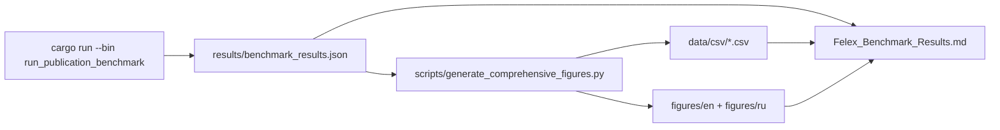

# Felex Benchmark Methodology

**Date:** 2026-03-29  
**Version:** 2.0  
**Tags:** #benchmark #methodology #reproducibility

## Scope

This benchmark package measures implemented optimization workflows only.

| Dimension | Canonical scope |
|---|---|
| Scenario catalog file | 40 scenarios in `data/json/benchmark_scenarios.json` |
| Executed optimization set | 23 scenarios in `results/benchmark_results.json` |
| Workflow variants | `build_from_library`, `complete_from_library`, `selected_only` |
| Total workflow runs | 69 (23 x 3) |

## Canonical Evidence Chain



## Data Inputs

| Input | Source |
|---|---|
| Feed composition authority | `database/output/feeds_database.json` -> benchmark catalog DB |
| Price anchors | `felex.db` (mapped into benchmark catalog) |
| Executable case list | `default_benchmark_cases()` in `src/diet_engine/benchmarking.rs` |

## Metrics Used

Metrics are read from `benchmark_results.json` workflow records:
- `runtime_ms`
- `cost_per_day_rub`
- `hard_pass_rate`
- `tier1_pass_rate`, `tier2_pass_rate`, `tier3_pass_rate`
- `norm_coverage_index`
- `deficiency_index`, `excess_index`, `target_gap_index`
- `constraint_violation_index`

No metric is accepted from prose unless it can be reproduced from this artifact.

## Reproducible Commands

Run from repository root:

```bash
python .claude/benchmarks/scripts/export_data.py
python .claude/benchmarks/scripts/run_benchmark.py
python .claude/benchmarks/scripts/generate_comprehensive_figures.py
python .claude/benchmarks/scripts/generate_nutrient_summary.py
```

## Interpretation Boundaries

- Benchmark conclusions apply to currently implemented optimizer/build/alternatives logic.
- Schema-only nutrient columns that are not wired through model + optimizer are out of benchmark scope.
- Agentic evaluation artifacts are supplementary; core benchmark statistics come from the 69 optimization workflow records.

## Artifact List

| Artifact | Path |
|---|---|
| Primary benchmark JSON | `.claude/benchmarks/results/benchmark_results.json` |
| Derived CSV tables | `.claude/benchmarks/data/csv/` |
| Figures (EN/RU) | `.claude/benchmarks/figures/en/`, `.claude/benchmarks/figures/ru/` |
| Results narrative | `.claude/benchmarks/Felex_Benchmark_Results.md` |
| Figure catalog | `.claude/benchmarks/Felex_Figure_Index.md` |
