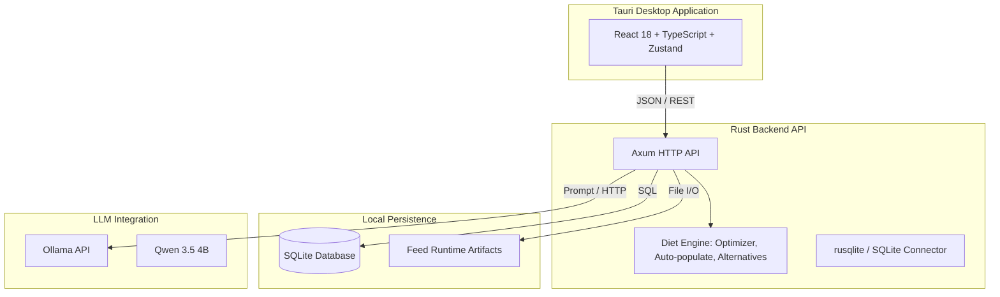

# Felex: Техническая документация (каноническая)

**Версия:** 3.1  
**Дата:** 2026-03-29  
**Статус:** Академическая техническая спецификация и руководство по эксплуатации

## 1. Назначение и область применения

Felex — это открытая, кроссплатформенная настольная система поддержки принятия решений (Decision Support System) для многокритериальной формуляции рационов кормления сельскохозяйственных животных (КРС, свиньи, птица). 
Главная цель платформы — предоставить специалистам по кормлению детерминированную среду оптимизации стоимости рациона при строгом соблюдении иерархических ограничений по питательным веществам, структуре рациона и биологической безопасности, дополненную локальным агентным контуром на базе больших языковых моделей (LLM) для интеллектуальной пре- и пост-оценки.

Система решает следующие задачи:
1. Минимизация стоимости рациона с помощью методов линейного программирования (LP).
2. Поддержка и сопоставление нескольких систем нормирования (например, NASEM, INRA, локальные стандарты).
3. Автоматическое конструирование рационов на основе заданных матриц совместимости кормов (Feed Matrix).
4. Офлайн-интерпретация рационов с использованием локальной LLM.

## 2. Развертывание и архитектура системы

Felex реализован по гибридной архитектуре, объединяющей производительность нативных вычислений, современный реактивный интерфейс и автономность.

### 2.1 Стек технологий
- **Frontend**: React 18, TypeScript, Vite. Управление состоянием осуществляется с помощью Zustand. Стилизация — Tailwind CSS.
- **Backend**: Rust 1.70+. Веб-сервер Axum для обработки HTTP-запросов от интерфейса.
- **Desktop Wrapper**: Tauri 2.0. Обеспечивает сборку нативного десктопного приложения, управление окнами и межпроцессное взаимодействие (IPC) без необходимости внешнего сервера.
- **Оптимизатор**: Библиотека `good_lp` / `minilp` для решения задач линейного программирования.
- **Слой данных**: Встроенная SQLite (`rusqlite`) для хранения норм и пользовательских конфигураций; сгенерированные JSON-артефакты кормовой базы.
- **LLM Интеграция**: Интеграция с Ollama для локального запуска моделей (по умолчанию Qwen 3.5 4B).

## 3. Операционная модель данных и система нормирования

### 3.1 Источник истины
Данные о кормах генерируются Python-пайплайном (`database/`) и импортируются в скомпилированные артефакты (`frontend/src/generated/`) и SQLite базу. Для продуктовой логики каноничны только те поля питательных веществ, которые одновременно:
1. Присутствуют в схеме Rust-модели `Feed` (`src/db/feeds.rs`).
2. Имеют валидные целевые значения и лимиты в модуле `norms`.
3. Фактически задействованы в `src/diet_engine/optimizer.rs` при построении матрицы LP.

### 3.2 Реализованный нутриентный контур
Оптимизатор работает со следующим подтвержденным набором нутриентов:
- **Базовые показатели**: Сухое вещество (`dry_matter`), обменная энергия (по видам животных: `energy_oe_cattle`, `energy_oe_pig`, `energy_oe_poultry`).
- **Протеин и аминокислоты**: Сырой протеин (`crude_protein`, `crude_protein_pct`), расщепляемый протеин. Поддерживается учет лизина (`lysine`), в том числе стандартизированного илеально-переваримого лизина (`lysine_sid` для свиней), метионина и цистина (`methionine_cystine`, `methionine_cystine_sid`).
- **Макро- и микроэлементы**: Кальций (`calcium`), фосфор (`phosphorus`), магний (`magnesium`), медь (`copper`), железо (`iron`), цинк (`zinc`). Поддерживается вычисление отношения кальция к фосфору (`ca_p_ratio`).
- **Витамины**: Витамин D3 (`vit_d3`), витамин E (`vit_e`), каротин (`carotene`).
- **Клетчатка**: Строго ограниченный контур — используется только сырая клетчатка (`crude_fiber`, `crude_fiber_pct`).

*Примечание: Поля NDF и ADF отсутствуют в операционном контуре и не участвуют в оптимизации.*

### 3.3 Механизмы Fallback
Система предусматривает адаптивную деградацию при отсутствии специфических данных. Например, если для корма не указано значение `lysine_sid`, система может использовать базовый `lysine` как fallback-значение или пересчитывать процентное соотношение `lysine_sid_pct` на основе общего протеина и сухого вещества.

## 4. Рабочие процессы оптимизации (Core Workflows)

Пользовательское взаимодействие с движком оптимизации разделено на три концептуальных намерения (Intent):

### 4.1 Build from Library (`build_from_library`)
Алгоритм начинает работу "с чистого листа" или с минимального пользовательского входа.
- Движок анализирует контекст животного (вид, вес, продуктивность).
- Загружает доступную кормовую матрицу (Feed Matrix) для данного вида.
- Автоматически отбирает кандидатов из глобальной библиотеки кормов.
- Строит рацион, минимизируя стоимость с соблюдением всех уровней ограничений.

### 4.2 Complete from Library (`complete_from_library`)
Режим дополнения. Пользователь вручную задает "каркас" рациона (например, фиксированное количество силоса или специфического концентрата).
- Движок фиксирует (или ограничивает диапазонами) пользовательские корма.
- Автоматически подбирает недостающие ингредиенты из библиотеки для балансировки дефицитных нутриентов.
- Является основным режимом для практикующих зоотехников, корректирующих базовые рационы хозяйств.

### 4.3 Selected Only (`selected_only`)
Строгая оптимизация в замкнутом пространстве ингредиентов.
- Пользователь выбирает конкретный список кормов.
- Движок не имеет права добавлять новые корма.
- Ищется оптимальная пропорция (веса) только среди выбранных кормов. Если решение невозможно без нарушения Tier 1 или Hard ограничений, возвращается статус невыполнимости (infeasible).

## 5. Механика оптимизации (Diet Engine)

### 5.1 Формализация задачи линейного программирования (LP)
Оптимизация рациона формулируется как задача минимизации стоимости:

$$ \min \sum_{i=1}^{n} c_i x_i $$

где $x_i$ — количество $i$-го корма (кг), $c_i$ — стоимость 1 кг $i$-го корма.

При соблюдении системы линейных неравенств (ограничений матрицы питательных веществ $A$ и вектора норм $b$):
$$ A x \geq b_{min} $$
$$ A x \leq b_{max} $$

### 5.2 Иерархия ограничений (Tiered Constraints)
Felex применяет механизм мягких ограничений (soft constraints relaxations) для обеспечения отказоустойчивости. Принципиальная невыполнимость LP-задачи (Infeasibility) решается путем пошагового ослабления ограничений:

1. **Hard Constraints**: Абсолютные пределы. Максимальная вместимость желудочно-кишечного тракта (лимит по сухому веществу), токсичные пороги микроэлементов. Не подлежат ослаблению.
2. **Tier 1**: Критические нутриенты (Обменная энергия, Сырой протеин, Кальций, Фосфор).
3. **Tier 2**: Вторичные показатели, прямо влияющие на продуктивность (Аминокислоты, например `lysine_sid`, клетчатка).
4. **Tier 3**: Мягкие оптимизационные цели (Микроэлементы, витамины).

Если `solve(Tier 1+2+3)` терпит неудачу, система пытается решить `solve(Tier 1+2)`, затем `solve(Tier 1)`, сигнализируя пользователю о дефицитах.

### 5.3 Feed Matrix и Auto-populate
Чтобы рацион не состоял из одного дешевого ингредиента, используется Матрица Кормов (Feed Matrix).
- Определяет категорийные ограничения (например, "доля грубых кормов для КРС не менее 40% от СВ").
- Ограничивает включение специфических кормов (например, "не более 2 кг жмыха").
- Реализована в `src/diet_engine/auto_populate.rs` и `src/diet_engine/feed_groups.rs`.

### 5.4 Альтернативные рационы
Генерация альтернатив (`src/diet_engine/alternatives.rs`) не использует отдельный движок. Она реализуется через:
- Штрафование доминирующих ингредиентов из базового решения (искусственное завышение их цены в LP-модели на итерацию).
- Принудительное включение суб-оптимальных, но доступных кормов.
Это позволяет предоставить пользователю 2-3 варианта рациона, незначительно отличающихся по цене, но имеющих разную структуру.

## 6. Интеграция с локальными LLM (Agent Layer)

Felex включает экспериментальный агентный контур, способный анализировать контекст без отправки данных в облако.
- **Движок**: Ollama (HTTP API на `localhost:11434`).
- **Модель**: Оптимизировано под `Qwen 3.5 4B` (для баланса качества и скорости на потребительских ПК).
- **Промптинг**: Система передает LLM структурированный JSON с весами ингредиентов, расчетными и целевыми нутриентами, а также животными характеристиками.
- **Ограничения**: Из-за размера контекста (до 4096 токенов) и склонности 4B-моделей к "галлюцинациям", агент используется исключительно в режиме интерпретатора (советника). Он **не** управляет весами кормов напрямую, а лишь указывает на возможные метаболические последствия (например, "Рацион дефицитен по витамину Е, рекомендуется добавить премикс").

## 7. Бенчмарк и производительность (Канонический срез)

Производительность алгоритмов регулярно измеряется через автоматизированный пайплайн (`.claude/benchmarks/scripts/`).
Результаты по 23 сценариям (69 запусков):

| Рабочий процесс | Ср. Время (мс) | Hard Pass Rate (%) | Norm Coverage (0-100) | Ср. Стоимость (RUB) |
|---|---:|---:|---:|---:|
| `build_from_library` | 534.4 | 66.0 | 83.2 | 165.0 |
| `complete_from_library`| 106.6 | 78.3 | 85.0 | 247.7 |
| `selected_only` | 0.4 | 50.2 | 77.1 | 136.3 |
| **Общее среднее** | **213.8** | **64.8** | **81.8** | **183.0** |

## 8. Связанные документы
- Память проекта: `memory/`
- Методология тестирования: `.claude/benchmarks/Felex_Benchmark_Methodology.md`
- Результаты бенчмарка: `.claude/benchmarks/Felex_Benchmark_Results.md`
