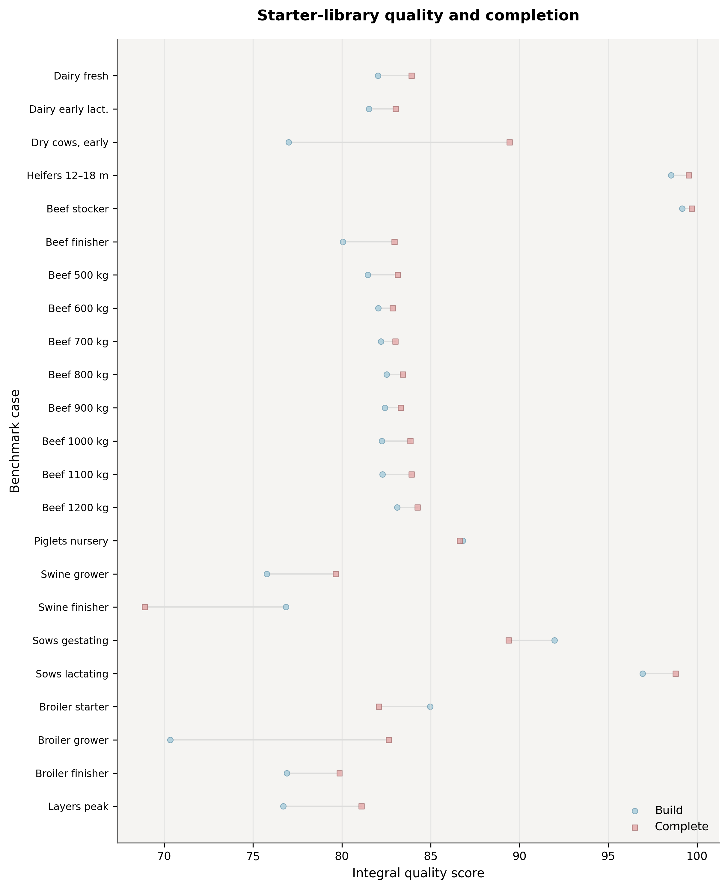
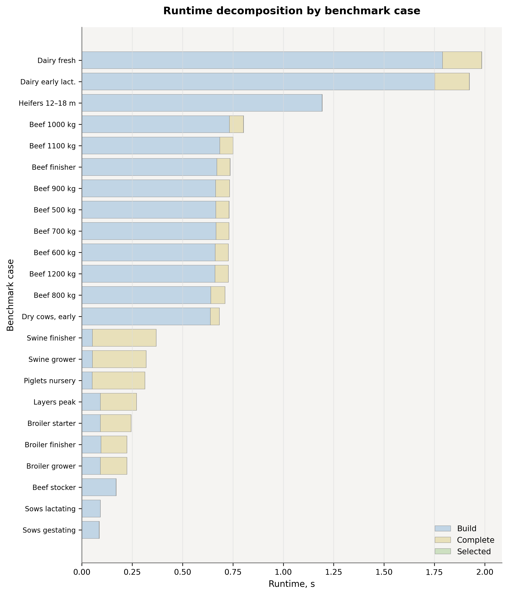
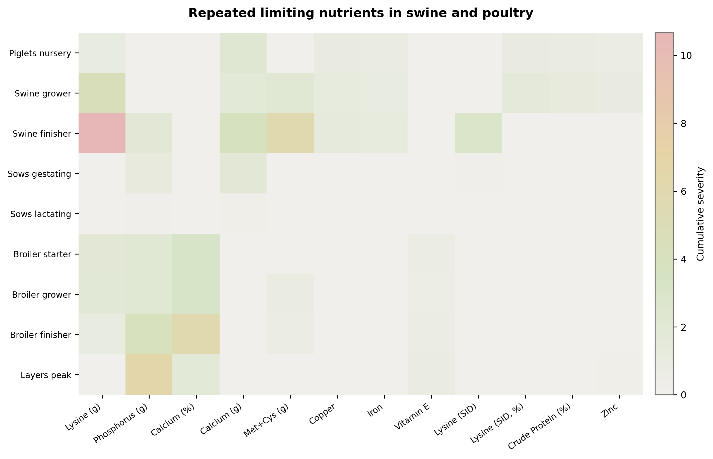
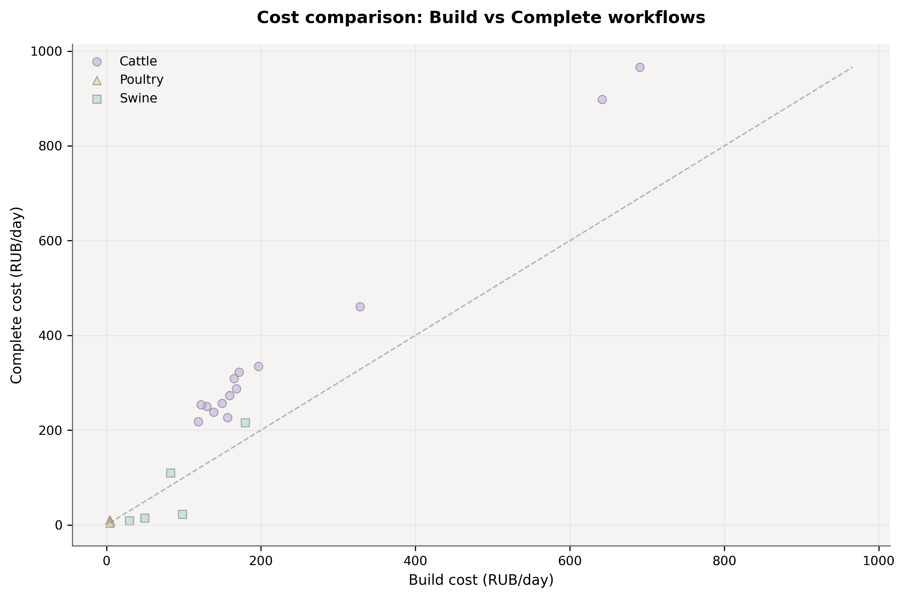

<p align="center">
  
</p>

<h1 align="center">Felex</h1>

<p align="center">
  <strong>Feed ration optimizer for livestock professionals</strong><br>
  Free &middot; Offline &middot; Open Source
</p>

<p align="center">
  <a href="https://github.com/danilkotelnikov/Felex/releases">Download</a> &middot;
  <a href="INSTALL.md">Installation</a> &middot;
  <a href="README.ru.md">Русская версия</a> &middot;
  <a href="docs/BENCHMARKS.md">Benchmarks</a>
</p>

---

## What is Felex?

Felex helps livestock specialists put together cost-optimal feed rations without breaking nutritional requirements. It runs entirely on your computer — no cloud, no subscriptions, no internet needed.

Under the hood: a Rust-based linear programming solver, a database of 2,200+ feed ingredients, and an optional local AI advisor that can comment on your ration. Supports **dairy and beef cattle, swine, and poultry**.

### What it does

| | |
|---|---|
| **LP Optimization** | Built-in pure-Rust solver (minilp) — no CPLEX, no Gurobi, no license fees |
| **3 Workflows** | Build a ration from scratch, complete a partial one, or balance a fixed set of feeds |
| **Smart Constraints** | Hard limits + 3 relaxation tiers so the solver finds a solution more often |
| **2,200+ Feeds** | Roughages, concentrates, silages, minerals, compound feeds, and more |
| **Multiple Norm Systems** | NASEM, INRA, and local Russian standards |
| **Alternative Rations** | 2–3 variants with different feed mixes and cost/quality comparison |
| **AI Advisor** | Local LLM via Ollama (Qwen 3.5) for metabolic commentary and suggestions |
| **Bilingual** | Full English and Russian UI — no hardcoded strings |
| **Reports** | Export to PDF, Excel, CSV |
| **Fully Offline** | Once installed, no internet required |

---

## How it works

```
┌──────────────────────────────────────────────┐
│              Tauri Desktop Shell              │
│  ┌────────────────┐  ┌────────────────────┐  │
│  │  React + Zustand│  │  Rust Axum API     │  │
│  │  Frontend (UI)  │──│  Server (:7432)    │  │
│  └────────────────┘  │  ┌──────────────┐  │  │
│                       │  │ LP Optimizer  │  │  │
│                       │  │ (good_lp)     │  │  │
│                       │  ├──────────────┤  │  │
│                       │  │ SQLite DB     │  │  │
│                       │  ├──────────────┤  │  │
│                       │  │ LLM Agent     │  │  │
│                       │  │ (Ollama)      │  │  │
│                       │  └──────────────┘  │  │
│                       └────────────────────┘  │
└──────────────────────────────────────────────┘
```

| Layer | Tech | Where |
|-------|------|-------|
| Desktop | Tauri 2.0 | `src-tauri/` |
| API Server | Rust, Axum 0.7, SQLite | `src/` |
| Optimizer | good_lp + minilp (pure Rust) | `src/diet_engine/` |
| UI | React 18, TypeScript, Tailwind CSS | `frontend/src/` |
| State | Zustand + TanStack Query | `frontend/src/stores/` |
| Data Pipeline | Python (web scraping, translation) | `database/` |
| AI Agent | Ollama / OpenAI-compatible | `src/agent/` |

---

## Optimization workflows

### 1. Build from scratch
Pick an animal type and stage — Felex selects suitable starter feeds from the library and optimizes proportions automatically.

### 2. Complete a partial ration
You bring one or two feeds you already have on the farm. Felex fills in the missing nutritional roles and balances everything together.

### 3. Optimize selected feeds only
Felex works strictly with the feeds you picked — no library additions, just proportion tuning.

```
  Your input ──► Workflow ──► Feed selection ──► LP Solver ──► Alternatives ──► Result
                    │                                               │
                    ├─ From scratch ──► full auto-populate          │
                    ├─ Complete ──────► add only what's missing     ├─► 2–3 variants
                    └─ Selected only ─► keep current set            └─► cost comparison
```

After solving, the alternatives engine produces **2–3 rations** at similar nutritional quality but with different feed combinations — handy when some ingredients aren't available.

---

## Benchmark results

Tested across **23 scenarios, 69 runs** (v2.0, March 2026):

| Metric | Value |
|--------|-------|
| Average solve time | **213.8 ms** |
| Hard constraint pass rate | **64.8%** |
| Norm coverage | **81.8%** |
| Average ration cost | **183 RUB/day** |

### By workflow

| Workflow | Runs | Time (ms) | Pass rate | Coverage | Cost (RUB/day) |
|----------|------|-----------|-----------|----------|----------------|
| From scratch | 23 | 534 | 66.0% | 83.2% | 165 |
| Complete | 23 | 107 | 78.3% | 85.0% | 248 |
| Selected only | 23 | 0.4 | 50.2% | 77.1% | 136 |

<p align="center">
  
  
</p>
<p align="center">
  
  
</p>

> Full methodology and raw data: [docs/BENCHMARKS.md](docs/BENCHMARKS.md)

---

## Quick start

### Ready-made installer (Windows)

Grab the `.msi` or `.exe` from the [Releases](https://github.com/danilkotelnikov/Felex/releases) page and run it. Done.

### Build from source

You'll need: Node.js 18+, Rust 1.70+, Visual Studio Build Tools (C++ workload)

```bash
git clone https://github.com/danilkotelnikov/Felex.git
cd Felex

# Automated setup (Windows)
powershell -ExecutionPolicy Bypass -File scripts/setup.ps1

# Or manually
npm install
npm run build:feed-runtime    # generate feed database artifacts

# Development
npm run dev:full               # starts Rust API + Vite dev server

# Build installer
npm run tauri:build            # produces .msi and .exe
```

> Step-by-step guide with troubleshooting: [INSTALL.md](INSTALL.md)

### AI advisor (optional)

To get AI commentary on your rations, install [Ollama](https://ollama.ai/download) and pull a model:

```bash
ollama pull qwen3.5:4b         # light, works on most PCs
ollama pull qwen3.5:9b         # better quality, needs 8+ GB RAM
```

---

## Feed database

Ships with **2,200+ feed ingredients** across 9 categories:

| Category | Count | Examples |
|----------|-------|---------|
| Roughages | 1,283 | Hay, straw, haylage |
| Green feeds | 411 | Pasture grasses, fresh forage |
| Concentrates | 301 | Grain, protein meals |
| Compound feeds | 205 | Complete feeds, starters |
| Animal-origin feeds | 29 | Milk, meat-and-bone meal |
| Industrial byproducts | 28 | Oilseed cakes, bran |
| Mineral supplements | 26 | Chalk, salts, premixes |
| Nitrogen supplements | 4 | Urea |

Each entry carries composition data for: dry matter, metabolizable energy, crude protein, amino acids (lysine, methionine+cystine), macro/micro minerals (Ca, P, Mg, Cu, Fe, Zn), vitamins (D3, E, carotene), and crude fiber.

---

## Project layout

```
Felex/
├── src/                        # Rust backend
│   ├── api/                    # HTTP routes (Axum)
│   ├── diet_engine/            # Optimizer, auto-populate, alternatives
│   ├── db/                     # SQLite schema, migrations, models
│   ├── norms/                  # Nutrition norm resolution
│   └── agent/                  # LLM integration
├── frontend/src/               # React + TypeScript UI
│   ├── components/             # UI components
│   ├── stores/                 # Zustand stores
│   ├── lib/                    # API clients, helpers
│   └── generated/              # Auto-generated feed data
├── database/                   # Python data pipeline
│   ├── output/                 # Feed database (JSON, source of truth)
│   └── tests/                  # Pipeline tests
├── src-tauri/                  # Tauri config
├── scripts/                    # Build & setup scripts
└── docs/                       # Documentation, benchmarks
```

---

## Tech stack

| Component | Technology |
|-----------|-----------|
| Backend | Rust 2021, Axum 0.7, Tokio |
| Database | SQLite (rusqlite, bundled) |
| LP Solver | good_lp 1.7 + minilp (pure Rust) |
| Desktop | Tauri 2.0 |
| Frontend | React 18.3, TypeScript 5.5 |
| Styling | Tailwind CSS 3.4 |
| Bundler | Vite 5.3 |
| State | Zustand 4.5, TanStack Query 5 |
| UI | Radix UI |
| i18n | i18next (EN/RU) |
| Charts | Recharts |
| Reports | printpdf, rust_xlsxwriter |
| AI | Ollama (Qwen 3.5 default) |
| Data pipeline | Python 3 (aiohttp, BeautifulSoup, Pydantic) |

---

## API

Backend serves REST on `localhost:7432/api/v1`:

| Endpoint | Method | What it does |
|----------|--------|-------------|
| `/feeds` | GET | List and filter feeds |
| `/feeds/:id` | GET | Single feed with full composition |
| `/rations` | GET/POST | List or create rations |
| `/rations/:id` | GET/PUT/DELETE | Read, update, delete a ration |
| `/rations/:id/optimize` | POST | Run the LP optimizer |
| `/rations/:id/alternatives` | POST | Get alternative ration variants |
| `/rations/:id/auto-populate` | POST | Preview starter feed plan |
| `/norms` | GET | Nutrition norms |
| `/animals` | GET | Supported species and stages |
| `/workspace` | GET/PUT | User workspace settings |
| `/agent/chat` | POST | AI chat (SSE stream) |

---

## Development

```bash
# Backend
cargo run --bin felex-server    # API on :7432
cargo test                      # tests

# Frontend
npm run dev                     # Vite on :5173

# Both at once
npm run dev:full

# Database migrations
cargo run --bin migrate

# Import feed data
cargo run --bin import-feeds

# Rebuild feed artifacts for the UI
npm run build:feed-runtime

# Lint
npm run lint
```

---

## Contributing

Happy to accept contributions:

1. Fork the repo
2. Create a branch (`git checkout -b feature/your-idea`)
3. Follow the code style described in [AGENTS.md](AGENTS.md)
4. Write tests for what you add
5. Open a Pull Request

---

## License

MIT — see [LICENSE](LICENSE).

---

<p align="center">
  Rust + React + Tauri<br>
  <sub>For livestock professionals who want reliable ration optimization without cloud dependencies</sub>
</p>
