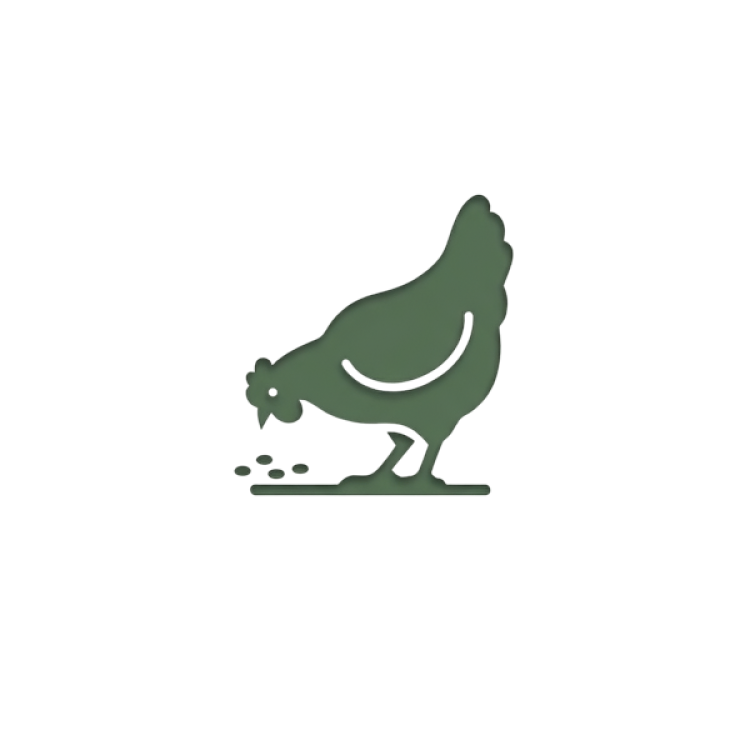

<p align="center">
  
</p>

<h1 align="center">Felex v1.0.1</h1>

<p align="center">
  <b>Открытое программное обеспечение для составления рационов кормления<br>сельскохозяйственных животных с интегрированным ИИ-агентом</b>
</p>

<p align="center">
  <a href="https://github.com/danilkotelnikov/Felex/releases/latest"></a>
  
  
  
</p>

<p align="center">
  <a href="#-установка">Установка</a> &bull;
  <a href="#-возможности">Возможности</a> &bull;
  <a href="#-архитектура">Архитектура</a> &bull;
  <a href="#-бенчмарки-производительности">Бенчмарки</a> &bull;
  <a href="#-ии-ассистент">ИИ-ассистент</a> &bull;
  <a href="#-сравнение-с-аналогами">Сравнение</a> &bull;
  <a href="#-возможные-вопросы">Возможные вопросы</a>
</p>

---

## О программе

**Felex** — бесплатное настольное приложение для расчёта, оптимизации и балансирования рационов кормления КРС (молочного и мясного направления), свиней и птицы. Распространяется под лицензией MIT.

Система объединяет **гибридный многостадийный оптимизатор** рационов и **ИИ-агента** на базе локальных языковых моделей (Qwen 3.5) с архитектурой RAG и поддержкой вызова инструментов (Tool Calling). Всё работает **локально на вашем компьютере** — интернет не требуется.

Затраты на корма составляют **60–70% себестоимости** продукции животноводства (Калашников и др., 2003). Felex позволяет снизить эти затраты, автоматически подбирая оптимальный состав рациона.

Разработка программного обеспечения велась с применением CLI-инструментов на основе LLM: **Claude Opus 4.5/4.6** (Anthropic) и **OpenAI Codex** (ChatGPT 5.4 xhigh).

---

## Установка

### Вариант 1: Исполняемый файл (рекомендуется)

1. Перейдите в **[Релизы](https://github.com/danilkotelnikov/Felex/releases/latest)**
2. Скачайте **`Felex.exe`** (10.6 МБ)
3. Поместите файл в удобную папку
4. Запустите **`Felex.exe`**

> Установка не требуется. Подходит для локального запуска и проверки сборки.

### Вариант 2: Установщик EXE

1. Скачайте **`Felex_1.0.1_x64-setup.exe`** (~743 КБ) из [Релизов](https://github.com/danilkotelnikov/Felex/releases/latest)
2. Запустите — следуйте мастеру установки (2 клика)
3. Запустите **Felex** из меню «Пуск»

### Вариант 3: MSI-установщик

Скачайте **`Felex_1.0.1_x64_ru-RU.msi`** (русский, 1.1 МБ) или **`Felex_1.0.1_x64_en-US.msi`** (английский) из [Релизов](https://github.com/danilkotelnikov/Felex/releases/latest).

### Системные требования

| | Минимум | Рекомендуется |
|---|---|---|
| **ОС** | Windows 10 (64-бит) | Windows 11 |
| **ОЗУ** | 4 ГБ | 8–16 ГБ (для ИИ) |
| **Диск** | 50 МБ | 500 МБ (с моделью ИИ) |
| **Процессор** | Любой x64 | Intel i5 / AMD Ryzen 5+ |
| **GPU (для ИИ)** | — | NVIDIA с 8+ ГБ VRAM |

---

## Возможности

### Движок расчёта рационов

- **80+ нутриентов** — энергия (ЭКЕ, ОЭ для КРС/свиней/птицы), протеин (сырой, переваримый, 11 аминокислот), клетчатка (НДК, КДК, лигнин), 17 минералов, 13 витаминов
- **3 режима оптимизации** — минимизация стоимости, балансировка нутриентов, фиксированный рацион
- **Авто-заполнение пустых рационов** — стартовый набор кормов по виду животного и группам кормов
- **Feed screening** — рекомендации по добавлению кормов при реальном дефиците Ca, аминокислот и других лимитирующих факторов
- **11 автоматических проверок** — дисбаланс Ca:P, дефицит энергии и протеина, токсичность селена, низкий НДК, сахаро-протеиновое соотношение и др.
- **Экономический анализ** — стоимость в день/месяц/год, себестоимость на кг молока/привеса, разбивка по категориям кормов

### Поддерживаемые виды животных

| Вид | Типы продуктивности |
|---|---|
| **КРС молочный** | Сухостойный, новотельный, ранняя/средняя/поздняя лактация (20–35+ кг/день) |
| **КРС мясной** | Выращивание (300–500+ кг), откорм |
| **Свиньи** | Стартер, гровер, финишер, супоросные и лактирующие свиноматки |
| **Птица** | Бройлер (стартер/ростовой/финишер), несушка (предъяйцевый/пик/поздний) |

Нормы кормления основаны на справочнике **Калашникова (2003)** и рекомендациях **NRC** (Dairy 2001, Swine 2012, Poultry 1994). Система поддерживает **24 пресета** норм с автоматической интерполяцией по удою, массе и возрасту.

### База кормов

- **300+ кормов** с полным нутриентным профилем (80+ показателей на корм)
- Российская и международная номенклатура кормов
- Автоматический импорт из государственной базы gov.cap.ru
- Создание собственных кормов по данным лабораторного анализа
- Отслеживание цен с историей изменений

### Интерфейс и функции

- **Перетаскивание** кормов в рационе (drag-and-drop)
- **Блокировка кормов** — фиксация количества при оптимизации
- **Породные корректировки** — нормы адаптируются для Голштинской, Симментальской, Джерсейской и др. пород
- **Экспорт отчётов** — PDF, Excel, CSV
- **Тёмная и светлая темы**
- **Русский и английский интерфейс** (i18next)
- **Рабочее пространство** — организация рационов в проекты и папки (.felex.json)

---

## Архитектура

Felex построена на **двухуровневой клиент-серверной архитектуре**, где оба уровня работают локально, обёрнутые в нативную оболочку Tauri 2.0:

```
┌────────────────────────────────────────────────────────────┐
│                   TAURI 2.0 (Desktop Shell)                │
│                                                            │
│  ┌─────────────────────┐    ┌────────────────────────────┐ │
│  │  React Frontend      │    │  Rust Backend (Axum)       │ │
│  │                      │    │                            │ │
│  │  Zustand Stores ────►├────┤► REST API (40+ маршрутов)  │ │
│  │  UI Components       │HTTP│  Diet Engine (LP-решатель) │ │
│  │  Tailwind CSS        │    │  SQLite (80+ столбцов)     │ │
│  │  i18n (Рус/Англ)     │    │  ИИ-агент (Ollama/OpenAI)  │ │
│  │  Recharts            │    │  Веб-скрапер (gov.cap.ru)  │ │
│  └─────────────────────┘    └────────────────────────────┘ │
└────────────────────────────────────────────────────────────┘
```

### Технологический стек

| Слой | Технология | Назначение |
|---|---|---|
| Язык бэкенда | **Rust** (Edition 2021) | Безопасность памяти, производительность |
| Веб-фреймворк | **Axum** 0.7 | Асинхронный HTTP-сервер |
| База данных | **SQLite** (rusqlite 0.31) | Встроенная СУБД, WAL-режим |
| LP-решатель | **good_lp** (minilp) | Симплекс-метод, чистый Rust |
| Фронтенд | **React 18** + **TypeScript** | Реактивный UI |
| Стили | **Tailwind CSS** 3.4 | Утилитарная CSS-система |
| Состояние | **Zustand** 4.5 | Управление состоянием |
| Десктоп | **Tauri 2.0** | Нативная оболочка (NSIS/MSI) |
| ИИ-бэкенд | **Ollama** | Локальный LLM-сервер |
| Модель LLM | **Qwen 3.5** (4B / 9B) | Языковая модель для ИИ-агента |

### Математическая модель оптимизации

В `v1.0.1` оптимизация работает как **многостадийный LP-контур**:

1. **Stage 0: Auto-populate** — пустой рацион получает стартовый набор кормов.
2. **Stage 1: Screening** — оценивается выполнимость текущего набора кормов и при необходимости выдаются рекомендации по добавлению ингредиентов.
3. **Stage 2: Tiered balance** — `BalanceNutrients` теперь использует приоритетные проходы по энергии, протеину/аминокислотам, клетчатке и минералам.
4. **Stage 3: Cost pass** — внутри найденной области выполнимости подбирается более дешёвое решение.

Решатель остаётся на **good_lp (minilp)**, но убран старый штраф за изменение количеств кормов, поэтому балансировка больше не «залипает» на исходном рационе.

---

## Бенчмарки производительности

Тестовая конфигурация: AMD Ryzen 7 8845HS, 16 ГБ DDR5, NVIDIA RTX 4060 Laptop (8 ГБ VRAM), NVMe SSD, Windows 11 Pro. Актуальный прогон выполнен 11.03.2026 командой `cargo run --quiet --bin perf_probe`.

### Расчёт питательности

| Сценарий | Среднее время | Вызовов/с |
|---|---|---|
| 8 ингредиентов | 0.000385 мс | 2.60 млн |
| 24 ингредиента | 0.001108 мс | 0.90 млн |
| 64 ингредиента | 0.002912 мс | 0.34 млн |

### Оптимизатор и рабочие этапы

| Сценарий | Режим | Среднее (мс) | Статус |
|---|---|---|---|
| dairy_low_fiber | minimize_cost | 0.214929 | Infeasible |
| dairy_low_fiber | balance | 0.978980 | Infeasible |
| grower_pig_lysine_deficit | balance | 0.688114 | Infeasible |
| layer_low_calcium | balance | 0.477134 | Optimal |
| layer_low_calcium | fixed | 0.469067 | Optimal |

Дополнительно:
- auto-populate: **31.8–50.7 мс**
- screening: **24.7–32.4 мс**
- невыполнимые сценарии теперь явно возвращают `Infeasible`, а не маскируются как отсутствие изменений

### ИИ-агент (thinking mode сохранён)

| Модель | Сценарии | Время |
|---|---|---|
| Qwen 3.5 4B | 2 развёрнутых ответа + 1 короткий пролог | 16.75–84.23 с |
| Qwen 3.5 9B | 3 развёрнутых ответа из 3 | 74.71–86.26 с |

Ключевое изменение `v1.0.1`: встроенный агент больше не отключает thinking mode. Бэкенд сохраняет `think: true`, применяет реальные `num_ctx` из интерфейса, уменьшает контекст при 5xx и может перевести запрос с 9B на 4B при локальном сбое раннера.

---

## Научная оценка корректности

Проведена экспертная верификация восьми типовых сценариев оптимизации рационов на основе Deep Research с использованием источников NRC, NASEM, Калашникова.

**Интегральная шкала:** 0–100 баллов (NA — адекватность норм, CE — качество расчёта, PF — практическая пригодность, SR — научная обоснованность; каждая субшкала 0–25).

| # | Сценарий | NA | CE | PF | SR | Итого | Уровень |
|---|---|---|---|---|---|---|---|
| 1 | Дойная корова 30 кг/день | 21 | 22 | 23 | 19 | **85** | Хорошо |
| 2 | Дойная корова 35 кг/день | 19 | 21 | 21 | 17 | **78** | Удовл. |
| 3 | КРС мясной 400 кг — откорм | 22 | 23 | 24 | 21 | **90** | Отлично |
| 4 | Откорм свиней 80–120 кг | 23 | 23 | 24 | 22 | **92** | Отлично |
| 5 | Бройлер финишер | 20 | 22 | 23 | 19 | **84** | Хорошо |
| 6 | Сухостойная корова (транзитная) | 17 | 20 | 19 | 15 | **71** | Удовл. |
| 7 | Подсосная свиноматка | 20 | 21 | 22 | 20 | **83** | Хорошо |
| 8 | Несушка пик яйцекладки | 21 | 22 | 23 | 20 | **86** | Хорошо |

**Средневзвешенная оценка: 83.6 / 100** — практический инструмент фермерского уровня.

---

## ИИ-ассистент

Felex включает встроенного **ИИ-диетолога** на базе локальных языковых моделей. Данные **не покидают ваш компьютер** — никакого облака.

**Архитектура агента:**
- LLM-бэкенд (Ollama или OpenAI-совместимый API)
- Система вызова инструментов (Tool Calling, до 5 итераций, 20 с таймаут на инструмент)
- RAG-модуль (Retrieval-Augmented Generation) на базе векторных эмбеддингов
- Контекстное окно: 8192 токенов
- Полный контекст рациона в системном промпте

**Что умеет:**
- Рекомендовать корма для устранения дефицитов в рационе
- Объяснять взаимодействие нутриентов и требования к кормлению
- Отвечать на вопросы о кормлении конкретных видов и групп животных
- Искать корма по нутриентному профилю в базе данных
- Вызывать функции системы (Tool Calling) для получения актуальных данных

**Поддерживаемые модели:**

| Модель | Размер | Время ответа | Требования к ОЗУ |
|---|---|---|---|
| Qwen 3.5 4B | 3.4 ГБ | 16–84 с | 8 ГБ RAM + 8 ГБ VRAM |
| Qwen 3.5 9B | 6.6 ГБ | 75–86 с | 16 ГБ RAM + 8+ ГБ VRAM (локально) |

### Настройка (необязательно — Felex полностью работает без ИИ):

1. Установите [Ollama](https://ollama.ai/download) (бесплатно, 1 минута)
2. Загрузите модель:
   ```
   ollama pull qwen3.5:4b
   ```
3. Запустите Felex — ИИ подключится автоматически

---

## Быстрый старт

### 1. Создайте рацион
- Нажмите **Файл → Новый рацион** или кнопку **+**
- Выберите группу животных (напр., *КРС молочный — 30 кг молока/день*)
- Укажите поголовье стада

### 2. Добавьте корма
- Откройте **Библиотеку кормов** на правой панели
- Нажмите **+** для добавления или перетащите корм в таблицу рациона
- Отрегулируйте количество (кг/день на голову)

### 3. Проверьте нутриенты
- Перейдите на вкладку **Нутриенты**
- Зелёный = норма, Жёлтый = на границе, Красный = критично

### 4. Оптимизируйте
- Нажмите кнопку **Оптимизировать**
- Выберите режим: *Минимизация стоимости* или *Балансировка нутриентов*
- Просмотрите результат — Felex подберёт количества кормов при минимальной стоимости

### 5. Экспортируйте
- **Файл → Экспорт** — PDF, Excel или CSV

---

## Сравнение с аналогами

| Характеристика | **Felex** | WinFeed | BESTMIX | Корм Оптима | СЕЛЭКС | КОРАЛЛ |
|---|---|---|---|---|---|---|
| Открытый код | **Да** | Нет | Нет | Нет | Нет | Нет |
| Лицензия | **MIT (бесплатно)** | Платная | Платная | Платная | 50–200 тыс. руб./год | Платная |
| LP-оптимизация | **Да** (minilp) | Да | Да | Да | Нет | Частичная |
| ИИ-ассистент | **Да** (LLM + RAG) | Нет | Нет | Нет | Нет | Нет |
| Нормы Калашникова | **Полные** | Частично | Нет | Полные | Ручной ввод | Полные (ВИЖ) |
| Рекомендации NRC | **Да** | Да | Да | Нет | Нет | Нет |
| Интерполяция норм | **Да** | Нет | Частичная | Нет | Нет | Нет |
| Веб-скрапинг цен | **Да** | Нет | Нет | Нет | Нет | Нет |
| Офлайн-работа | **Да** | Да | Нет | Да | Да (Firebird) | Да |
| Виды животных | 4 | 6+ | 10+ | 3 | 2 (КРС) | 5+ |
| Нутриентов | **80+** | 50+ | 100+ | 40+ | 30+ | 40+ |
| Экспорт | **PDF, Excel, CSV** | Excel | Excel, PDF | Excel | Печать | Excel |
| Мультиязычность | **Рус/Англ** | Англ | Англ/Нид | Рус | Рус | Рус |
| Размер установки | **744 КБ** | ~50 МБ | ~200 МБ | ~30 МБ | ~150 МБ | ~50 МБ |

---

## Нормы кормления

Felex включает нормы из авторитетных источников:

- **Калашников А.П. и др.** — Нормы и рационы кормления с.-х. животных. 3-е изд. (2003)
- **NRC Dairy Cattle** — Nutrient Requirements of Dairy Cattle, 7th ed. (2001)
- **NRC Swine** — Nutrient Requirements of Swine, 11th ed. (2012)
- **NRC Poultry** — Nutrient Requirements of Poultry, 9th ed. (1994)

Все нормы настраиваемые — вы можете переопределить любое значение для ваших условий.

---

## Возможные вопросы

**В: Felex действительно бесплатный?**
Да, полностью бесплатный и с открытой лицензией (MIT). Без подписок, рекламы и сбора данных.

**В: Нужен ли интернет?**
Нет. Felex работает на 100% офлайн. Интернет нужен только для загрузки модели ИИ и обновления цен.

**В: Можно ли добавить свои корма?**
Да. Нажмите «Создать корм» и введите данные лабораторного анализа. Также можно импортировать из CSV/Excel.

**В: Насколько точна оптимизация?**
Felex использует тот же математический метод (LP, симплекс-метод), что и коммерческие WinFeed и BESTMIX. Интегральная оценка научной обоснованности — **83.6/100** (экспертная верификация по 8 сценариям).

**В: Безопасны ли мои данные?**
Всё остаётся на вашем компьютере. Без облака, без телеметрии, без учётных записей.

**В: Чем Felex отличается от СЕЛЭКС?**
СЕЛЭКС — система племенного и зоотехнического учёта (Win32, Firebird). Felex — современное кроссплатформенное приложение с LP-оптимизатором рационов, ИИ-агентом и поддержкой как российских, так и международных норм. Felex бесплатен (MIT), СЕЛЭКС — платный (50–200 тыс. руб./год).

---

## Лицензия

MIT License — свободное использование в личных, образовательных и коммерческих целях.

© 2024–2026 Данил Котельников

---

<p align="center">
  <b>Создано для фермеров, зоотехников и исследователей</b>
</p>

<p align="center">
  <a href="https://github.com/danilkotelnikov/Felex/releases/latest">
    
  </a>
</p>
