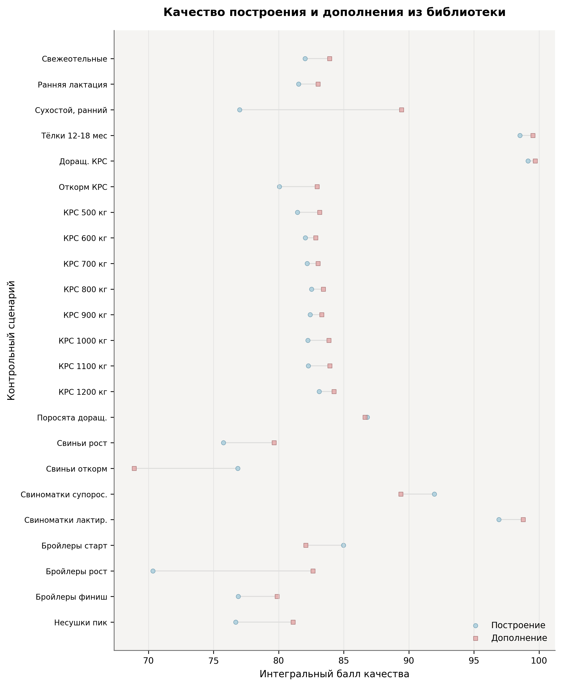
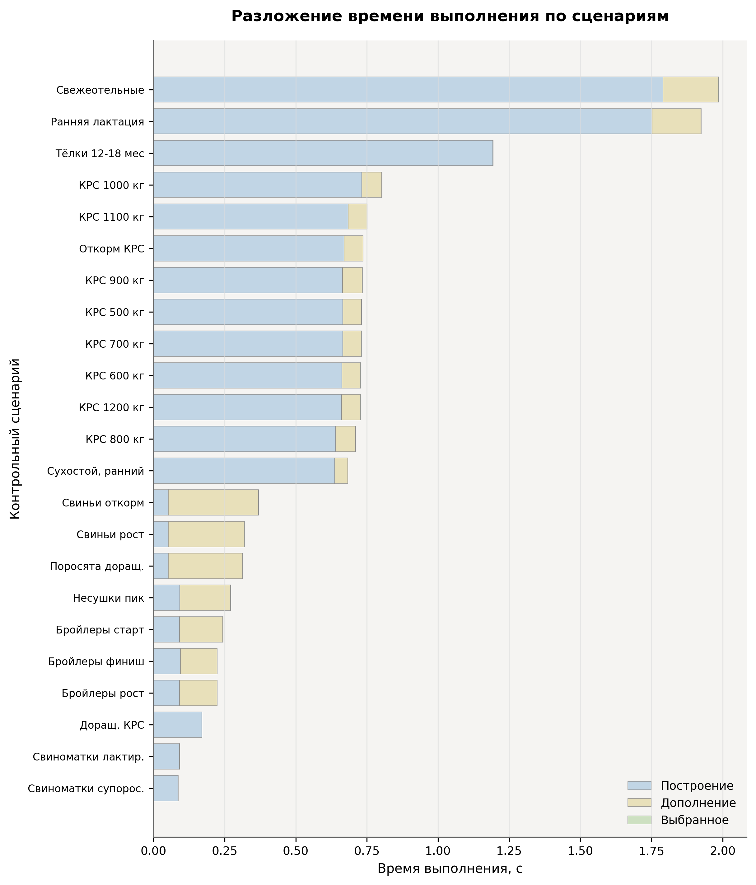
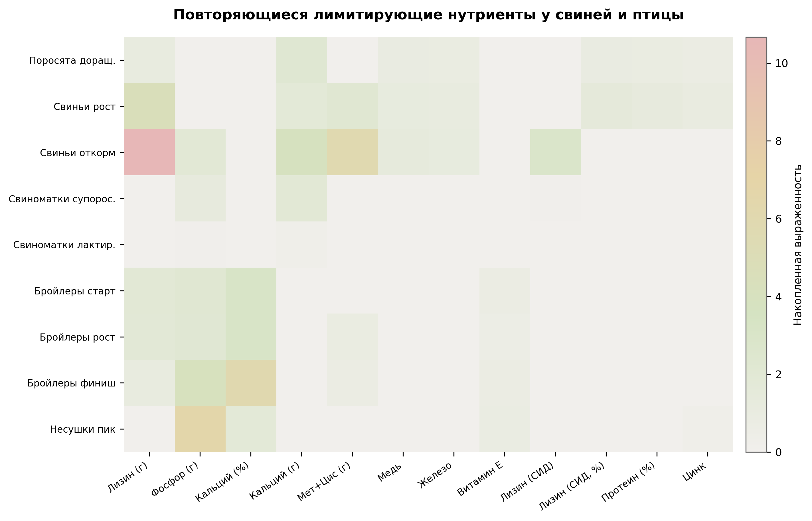
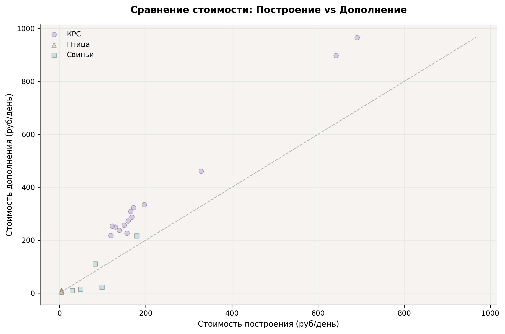

<p align="center">
  
</p>

<h1 align="center">Felex</h1>

<p align="center">
  <strong>Расчёт и оптимизация рационов кормления животных</strong><br>
  Бесплатно &middot; Работает без интернета &middot; Открытый код
</p>

<p align="center">
  <a href="https://github.com/danilkotelnikov/Felex/releases">Скачать</a> &middot;
  <a href="INSTALL.md">Установка</a> &middot;
  <a href="README.md">English version</a> &middot;
  <a href="docs/BENCHMARKS.md">Тесты производительности</a>
</p>

---

## О программе

Felex помогает зоотехникам составлять рационы кормления с минимальной стоимостью, не нарушая нормы по питательности. Программа работает целиком на вашем компьютере — ничего не отправляется в облако, интернет не нужен.

Внутри — решатель линейного программирования на Rust, справочник из 2 200+ кормов и (по желанию) локальный ИИ-помощник, который может прокомментировать рацион.

Поддерживаются **молочный и мясной КРС, свиньи и птица**.

### Что умеет

| | |
|---|---|
| **Оптимизация** | Встроенный ЛП-решатель (minilp) — не нужны ни CPLEX, ни Gurobi, ни лицензии |
| **Три сценария работы** | Собрать рацион с нуля, дополнить имеющийся или сбалансировать фиксированный набор кормов |
| **Гибкие ограничения** | Жёсткие нормы + три уровня допусков, чтобы задача чаще находила решение |
| **2 200+ кормов** | Грубые, зелёные, концентраты, комбикорма, минеральные добавки и т.д. |
| **Нормы из разных систем** | NASEM, INRA, отечественные справочники |
| **Альтернативные рационы** | 2–3 варианта с разным набором кормов и сравнением по цене |
| **ИИ-помощник** | Локальная языковая модель (Ollama / Qwen 3.5) — советы по метаболизму и кормлению |
| **Русский и английский** | Интерфейс полностью переведён, без «захардкоженных» строк |
| **Отчёты** | Выгрузка в PDF, Excel, CSV |
| **Работает офлайн** | После установки интернет не нужен |

---

## Как устроена программа

```
┌──────────────────────────────────────────────┐
│                Tauri (оболочка)               │
│  ┌────────────────┐  ┌────────────────────┐  │
│  │  React + Zustand│  │  Rust Axum API     │  │
│  │  Интерфейс     │──│  Сервер (:7432)    │  │
│  └────────────────┘  │  ┌──────────────┐  │  │
│                       │  │ ЛП-решатель  │  │  │
│                       │  │ (good_lp)     │  │  │
│                       │  ├──────────────┤  │  │
│                       │  │ SQLite        │  │  │
│                       │  ├──────────────┤  │  │
│                       │  │ LLM-агент    │  │  │
│                       │  │ (Ollama)      │  │  │
│                       │  └──────────────┘  │  │
│                       └────────────────────┘  │
└──────────────────────────────────────────────┘
```

| Слой | Технологии | Где лежит |
|------|-----------|-----------|
| Десктоп | Tauri 2.0 | `src-tauri/` |
| Сервер | Rust, Axum 0.7, SQLite | `src/` |
| Оптимизатор | good_lp + minilp (чистый Rust) | `src/diet_engine/` |
| Интерфейс | React 18, TypeScript, Tailwind CSS | `frontend/src/` |
| Состояние | Zustand + TanStack Query | `frontend/src/stores/` |
| Сбор данных | Python (парсинг сайтов, перевод) | `database/` |
| ИИ-агент | Ollama / OpenAI-совместимый бэкенд | `src/agent/` |

---

## Сценарии оптимизации

### 1. Собрать рацион с нуля
Вы указываете вид и стадию животного — программа сама подбирает корма из справочника и оптимизирует пропорции.

### 2. Дополнить имеющийся рацион
Вы задаёте один-два корма, которые уже есть в хозяйстве. Felex добавляет недостающие компоненты из библиотеки и балансирует рацион.

### 3. Только выбранные корма
Программа оптимизирует пропорции строго из тех кормов, которые вы указали. Ничего лишнего не добавляется.

```
  Ваш ввод ──► Сценарий ──► Подбор кормов ──► ЛП-решатель ──► Альтернативы ──► Готовый рацион
                  │                                                  │
                  ├─ С нуля ──────────► полный автоподбор             │
                  ├─ Дополнить ───────► добавить только недостающее   ├─► 2–3 варианта
                  └─ Только мои ──────► ничего не добавлять           └─► сравнение по цене
```

После расчёта программа предлагает **2–3 альтернативных рациона** — с тем же уровнем питательности, но с другим набором кормов. Это удобно, когда каких-то кормов нет в наличии.

---

## Результаты тестирования

Протестировано на **23 сценариях, 69 прогонах** (v2.0, март 2026):

| Показатель | Значение |
|-----------|----------|
| Среднее время расчёта | **213,8 мс** |
| Соблюдение жёстких ограничений | **64,8%** |
| Покрытие норм | **81,8%** |
| Средняя стоимость рациона | **183 руб./день** |

### Сравнение сценариев

| Сценарий | Прогоны | Время (мс) | Ограничения | Покрытие | Стоимость |
|----------|---------|-----------|-------------|----------|-----------|
| С нуля | 23 | 534 | 66,0% | 83,2% | 165 руб. |
| Дополнение | 23 | 107 | 78,3% | 85,0% | 248 руб. |
| Только выбранные | 23 | 0,4 | 50,2% | 77,1% | 136 руб. |

<p align="center">
  
  
</p>
<p align="center">
  
  
</p>

> Подробнее о методике: [docs/BENCHMARKS.md](docs/BENCHMARKS.md)

---

## Быстрый старт

### Готовый установщик (Windows)

Скачайте `.msi` или `.exe` со страницы [релизов](https://github.com/danilkotelnikov/Felex/releases) и запустите. Всё.

### Сборка из исходников

Понадобится: Node.js 18+, Rust 1.70+, Visual Studio Build Tools (компонент C++)

```bash
git clone https://github.com/danilkotelnikov/Felex.git
cd Felex

# Автоматическая настройка (Windows)
powershell -ExecutionPolicy Bypass -File scripts/setup.ps1

# Или вручную
npm install
npm run build:feed-runtime    # собрать справочник кормов

# Запуск в режиме разработки
npm run dev:full               # поднимает и Rust API, и фронтенд

# Собрать установщик
npm run tauri:build            # создаёт .msi и .exe
```

> Подробная инструкция — в [INSTALL.md](INSTALL.md)

### ИИ-помощник (необязательно)

Если хотите, чтобы программа давала комментарии по рациону, установите [Ollama](https://ollama.ai/download) и скачайте модель:

```bash
ollama pull qwen3.5:4b         # лёгкая, подходит для большинства ПК
ollama pull qwen3.5:9b         # качественнее, но нужно 8+ ГБ ОЗУ
```

---

## Справочник кормов

В комплекте — **2 200+ кормовых ингредиентов** по 9 категориям:

| Категория | Записей | Примеры |
|-----------|---------|---------|
| Грубые корма | 1 283 | Сено, солома, сенаж |
| Зелёные корма | 411 | Пастбищные травы, зелёнка |
| Концентраты | 301 | Зерно, белковые корма |
| Комбикорма | 205 | Полнорационные, стартерные |
| Корма животного происхождения | 29 | Молоко, мясо-костная мука |
| Побочные продукты | 28 | Жмыхи, шроты, отруби |
| Минеральные добавки | 26 | Мел, соли, премиксы |
| Азотистые добавки | 4 | Карбамид (мочевина) |

По каждому корму хранятся данные по сухому веществу, обменной энергии, сырому протеину, аминокислотам (лизин, метионин+цистин), макро- и микроэлементам (Ca, P, Mg, Cu, Fe, Zn), витаминам (D3, E, каротин) и клетчатке.

---

## Структура проекта

```
Felex/
├── src/                        # Rust-бэкенд
│   ├── api/                    # HTTP-маршруты (Axum)
│   ├── diet_engine/            # Оптимизатор, автоподбор, альтернативы
│   ├── db/                     # SQLite: схема, миграции, модели
│   ├── norms/                  # Расчёт норм питания
│   └── agent/                  # Интеграция с LLM
├── frontend/src/               # React + TypeScript
│   ├── components/             # Компоненты интерфейса
│   ├── stores/                 # Хранилища (Zustand)
│   ├── lib/                    # API-клиенты, утилиты
│   └── generated/              # Сгенерированные данные кормов
├── database/                   # Python-пайплайн
│   ├── output/                 # Справочник кормов (JSON)
│   └── tests/                  # Тесты
├── src-tauri/                  # Настройки Tauri
├── scripts/                    # Скрипты сборки
└── docs/                       # Документация, графики
```

---

## Для разработчиков

```bash
# Бэкенд
cargo run --bin felex-server    # API на :7432
cargo test                      # тесты

# Фронтенд
npm run dev                     # Vite на :5173

# Всё вместе
npm run dev:full

# Миграции базы
cargo run --bin migrate

# Импорт кормов
cargo run --bin import-feeds

# Пересобрать справочник кормов
npm run build:feed-runtime

# Линтер
npm run lint
```

---

## Хотите помочь?

Будем рады вашему участию:

1. Сделайте форк
2. Создайте ветку (`git checkout -b feature/название`)
3. Придерживайтесь стиля кода — он описан в [AGENTS.md](AGENTS.md)
4. Напишите тесты
5. Откройте Pull Request

---

## Лицензия

MIT — подробности в файле [LICENSE](LICENSE).

---

<p align="center">
  Rust + React + Tauri<br>
  <sub>Для тех, кому нужен надёжный расчёт рационов без облаков и подписок</sub>
</p>
