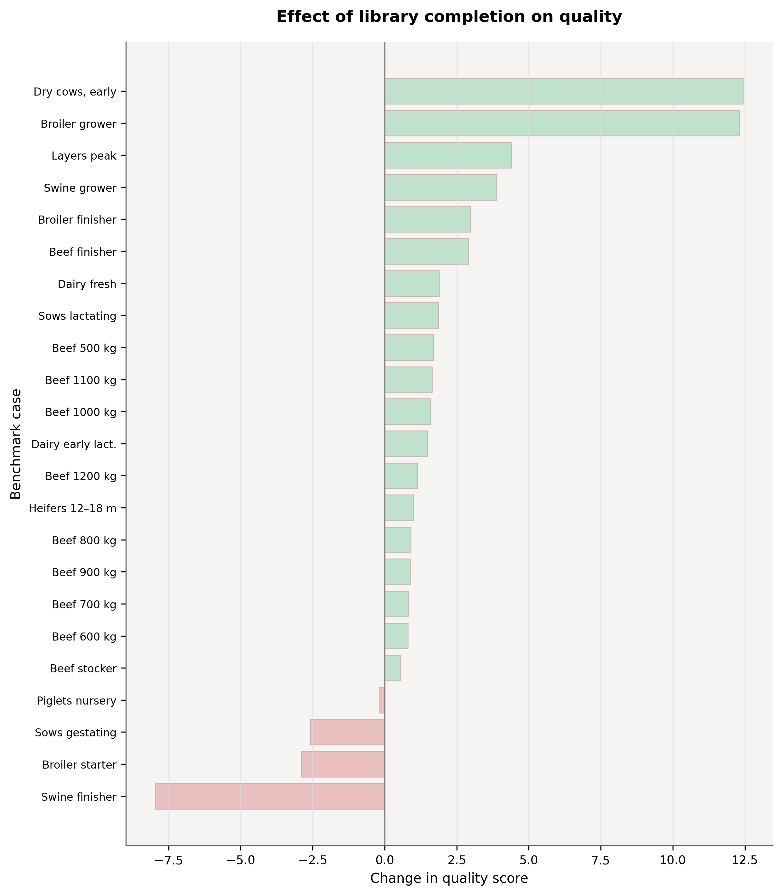

# Felex Benchmark Report

**Version:** 2.0
**Date:** 2026-03-29
**Source of truth:** `.claude/benchmarks/results/benchmark_results.json`

---

## Overview

This benchmark measures how well Felex's three optimization workflows perform across a set of real-world-like scenarios covering different animal species, production stages, and feed availability conditions.

| | |
|---|---|
| Scenarios executed | 23 |
| Workflow runs | 69 (23 scenarios x 3 workflows) |
| Mean solve time | 213.8 ms |
| Mean hard pass rate | 64.8% |
| Mean norm coverage | 81.8% |
| Mean ration cost | 183 RUB/day |

---

## What was measured

Each scenario defines an animal (species, weight, production stage) and a set of available feeds. For every scenario, all three workflows are executed:

- **build_from_library** — auto-selects feeds from the full library, then optimizes
- **complete_from_library** — takes user-provided feeds, adds missing roles, optimizes
- **selected_only** — optimizes proportions within the given feed set only

### Metrics

| Metric | What it means |
|--------|--------------|
| `runtime_ms` | Time to solve (milliseconds) |
| `hard_pass_rate` | % of hard nutritional constraints satisfied |
| `norm_coverage_index` | Overall coverage of all tracked norms (0–100) |
| `cost_per_day_rub` | Ration cost in RUB per day |
| `tier1_pass_rate` | Pass rate for Tier 1 (important but relaxable) constraints |
| `tier2_pass_rate` | Pass rate for Tier 2 constraints |
| `tier3_pass_rate` | Pass rate for Tier 3 (nice-to-have) constraints |
| `deficiency_index` | How far below norms the ration falls |
| `excess_index` | How far above norms the ration goes |

---

## Results by workflow

| Workflow | Runs | Time (ms) | Pass Rate | Coverage | Cost (RUB/day) |
|----------|------|-----------|-----------|----------|----------------|
| `build_from_library` | 23 | 534.4 | 66.0% | 83.2% | 165.0 |
| `complete_from_library` | 23 | 106.6 | 78.3% | 85.0% | 247.7 |
| `selected_only` | 23 | 0.4 | 50.2% | 77.1% | 136.3 |

### Key observations

**`complete_from_library` is the strongest all-around performer.** It has the highest pass rate (78.3%) and best norm coverage (85.0%), likely because it benefits from both user intent (seed feeds) and library breadth.

**`build_from_library` takes the most time** (534 ms average) because it searches the full library for starter feeds before optimizing. Still well under a second.

**`selected_only` is near-instant** (~0.4 ms) but constrained. With a fixed feed set, the solver has less room to meet all norms — hence the lower 50.2% pass rate. This is expected and by design.

**Cost varies by workflow.** `complete_from_library` tends to produce more expensive rations (248 RUB/day) because it adds feeds to fill gaps. `selected_only` is cheapest (136 RUB/day) because it only works with what's given.

---

## Figures

### Quality metrics across scenarios


### Quality improvement from library completion



### Solve time distribution


### Nutrient coverage heatmap


### Cost vs. quality scatter


---

## How to reproduce

All benchmark infrastructure is in `.claude/benchmarks/`. From the repo root:

```bash
# Export scenario data
python .claude/benchmarks/scripts/export_data.py

# Run the benchmark suite
python .claude/benchmarks/scripts/run_benchmark.py

# Regenerate figures and CSV summaries
python .claude/benchmarks/scripts/generate_comprehensive_figures.py

# Generate nutrient-level summary
python .claude/benchmarks/scripts/generate_nutrient_summary.py
```

### Data inputs

| Input | Source |
|-------|--------|
| Feed compositions | `database/output/feeds_database.json` |
| Price data | Runtime SQLite database |
| Scenario definitions | `default_benchmark_cases()` in `src/diet_engine/benchmarking.rs` |

---

## Limitations

- Results cover 23 scenarios from the internal benchmark catalog — they're representative but not exhaustive.
- The benchmark measures the optimizer and constraint system as currently implemented. Schema-only nutrient columns that aren't wired into the solver are not part of these results.
- Cost figures use reference prices and may differ from actual farm economics.
- The AI agent layer is evaluated separately and is not part of core benchmark metrics.

---

## Derived artifacts

| Artifact | Path |
|----------|------|
| Raw benchmark JSON | `.claude/benchmarks/results/benchmark_results.json` |
| CSV summaries | `.claude/benchmarks/data/csv/` |
| English figures | `.claude/benchmarks/figures/en/` |
| Russian figures | `.claude/benchmarks/figures/ru/` |
