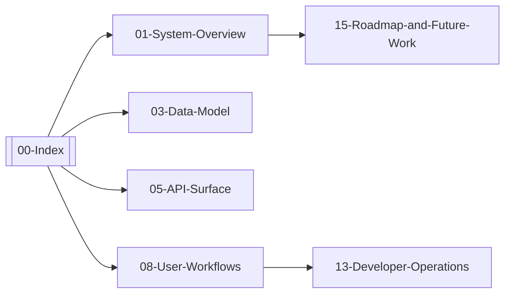

# 00 Index - Felex Project Memory

**Updated:** 2026-03-30  
**Owner:** repository  
**Related:** [[01-System-Overview]], [[03-Data-Model]], [[05-API-Surface]], [[13-Operating-Rules]]  
**Tags:** #memory #index #navigation

## Purpose

Single entry point for canonical operational truth.  
This note routes readers to implementation-backed memory only.

## Canonical Rules Snapshot

- DB-derived feed nutrient values are authoritative for metric statements.
- Optimization behavior is constrained by implemented objective keys and tier logic in `src/diet_engine/optimizer.rs`.
- Builder behavior is constrained by starter/feed-matrix logic in `src/diet_engine/auto_populate.rs`, `src/diet_engine/feed_groups.rs`, and category constraints from `RationMatrix`.
- Alternatives are generated by `src/diet_engine/alternatives.rs` and surfaced through the rations API.
- Any nutrient or feature not wired end-to-end (schema -> model -> optimizer/API) is non-operational and must not be claimed as active behavior.

## Quick Navigation

| Area | Primary Notes | Status |
|---|---|---|
| Architecture | [[01-System-Overview]], [[03-Data-Model]], [[05-API-Surface]] | Active |
| Workflows | [[08-User-Workflows]], [[02-Domain-Rules]] | Active |
| Operations | [[13-Operating-Rules]], [[13-Developer-Operations]] | Active |
| Governance | [[09-Change-Log]], [[10-Decision-Records]], [[15-Roadmap-and-Future-Work]] | Active |

## Core Map

## Note Registry

<!-- AUTO-INDEX:START -->
- [[01-System-Overview]]
- [[02-Domain-Rules]]
- [[03-Data-Model]]
- [[04-Content-Lifecycle]]
- [[05-API-Surface]]
- [[06-Customizations-vs-Vendor]]
- [[07-Security-Rules]]
- [[08-User-Workflows]]
- [[09-Change-Log]]
- [[10-Decision-Records]]
- [[11-Glossary]]
- [[12-Dependency-Map]]
- [[13-Developer-Operations]]
- [[13-Operating-Rules]]
- [[14-Session-Inbox]]
- [[15-Roadmap-and-Future-Work]]
- [[16-Implementation-Audit-and-Code-Graph]]
<!-- AUTO-INDEX:END -->

## Current Consistency Focus

- Keep `memory/` aligned with implemented backend behavior.
- Keep `.claude/benchmarks` prose aligned with regenerated benchmark outputs.
- Keep technical documentation and manuscript claims bounded by executable evidence.
- Distinguish raw feed-export counts from deduplicated runtime or benchmark-catalog counts when reporting library size.
