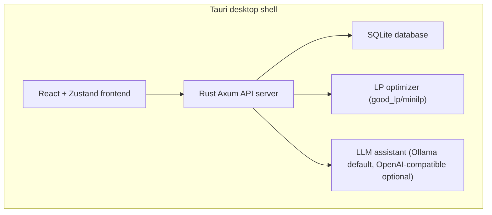

# 01 System Overview

**Updated:** 2026-03-30  
**Owner:** repository  
**Related:** [[03-Data-Model]], [[05-API-Surface]], [[08-User-Workflows]]  
**Tags:** #memory #system #architecture

## Mission

Felex is a local desktop system for animal ration formulation.  
It combines a Rust LP optimizer, a feed library database, and a React UI.

## Transport Model

- In Tauri production, the frontend talks to the embedded Axum server over HTTP on `localhost:7432`.
- Tauri IPC is present for bootstrap and desktop utility commands, but the main ration workflow uses the REST API exposed by `src/lib.rs`.
- Do not describe the core frontend-to-backend path as pure Tauri IPC.

## Runtime Architecture

## Operational Boundaries

### 1) Nutrient authority

- Authority begins with DB-derived feed values and migrated schema.
- A nutrient is operational only when wired through:
  - `src/db/feeds.rs` model fields + queries,
  - `src/diet_engine/optimizer.rs` objective keys and calculations,
  - API serialization/consumption.
- Do not claim nutrients that exist only in historical prose or partial schema.

### 2) Optimization scope

- The optimizer evaluates only implemented keys from `ALL_OPTIMIZER_KEYS`.
- Tier behavior (`Tier1`, `Tier2`, `Tier3`) is assigned in `constraint_tier_for_key`.
- Effective norm keys are species-specific via canonicalization in `api/rations.rs`.
- Category share constraints are applied through `RationMatrix` in `apply_category_constraints`.

### 3) Builder/feed-matrix scope

- Starter ration building is implemented in `src/diet_engine/auto_populate.rs`.
- Candidate selection uses runtime feed groups and suitability filters from `feed_groups`.
- Slot shares come from species/stage templates and are converted into starter feed amounts.
- `build_from_library` creates a ration from starter items for empty inputs.
- `complete_from_library` merges starter items into sparse rations.

### 4) Alternatives scope

- Alternatives are generated in `src/diet_engine/alternatives.rs`.
- The primary solution is followed by diverse candidates with:
  - feed exclusion/escalation,
  - near-duplicate filtering,
  - equivalence-band checks (cost and adequacy),
  - comparison metadata (common feeds, differentiators, ranges).
- API exposure:
  - `/rations/:id/optimize` includes alternatives for feasible solutions.
  - `/rations/:id/alternatives` returns explicit multi-solution payload.

## Core Modules

| Module | Role |
|---|---|
| `src/diet_engine` | Optimization, starter plan, alternatives, nutrient/economic calculations |
| `src/api` | REST routes for feeds, rations, norms, agent, workspace, prices |
| `src/db` | SQLite schema, migrations, feed/ration persistence |
| `src/norms` | Norm resolution and species/stage-specific requirements |
| `frontend/src` | UI flows and state for ration editing and optimization |

## Execution Notes

- The Tauri wrapper starts an embedded HTTP API server and waits for readiness before exposing the UI.
- Frontend API clients in `frontend/src/lib/api.ts` and `frontend/src/lib/workspace-api.ts` target `/api/v1` in dev and `http://localhost:7432/api/v1` inside Tauri.
- Some Tauri commands remain for desktop-only utilities such as export and opening external URLs.

## Current Consistency Notes

- `src/nutrients/manifest.rs` and `src/db/schema.rs` are not fully synchronized for every nutrient-like field; treat optimizer/API wiring as the executable boundary.
- Ratio metrics such as `ca_p_ratio` are calculated in logic, not persisted as base feed columns.
- Historical benchmark and manuscript prose must not be treated as implementation proof.
- The agent layer is configurable: `ollama` is the default backend, but `openai` is also supported in `src/agent/config.rs` and `src/agent/llm.rs`.
