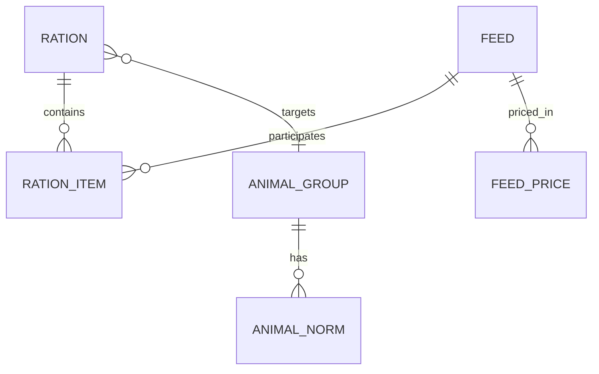

# 03 Data Model

**Updated:** 2026-03-29  
**Owner:** repository  
**Related:** [[00-Index]], [[01-System-Overview]], [[05-API-Surface]]  
**Tags:** #memory #data #schema

## Core Entities

| Entity | Storage | Runtime model |
|---|---|---|
| Feed | `feeds` | `src/db/feeds.rs::Feed` |
| FeedPrice | `feed_prices`, `feed_price_history` | `src/db/prices.rs` |
| Ration | `rations` | `src/db/rations.rs` |
| RationItem | `ration_items` | `src/db/rations.rs` |
| Animal group/norm | `animal_groups`, `animal_norms` | `src/norms/*` |

## Feeds Nutrient Authority Model

### Source-of-truth principle

- DB values are authoritative inputs.
- A nutrient metric is operational only if it is mapped in `Feed`, then consumed by optimizer/objective logic.

### Current operational feed fields

Operational nutrient fields currently wired through `Feed` and optimizer/API include:

- Energy/intake: `dry_matter`, `energy_oe_cattle`, `energy_oe_pig`, `energy_oe_poultry`
- Protein/amino: `crude_protein`, `dig_protein_cattle`, `dig_protein_pig`, `dig_protein_poultry`, `lysine`, `methionine_cystine`
- Composition: `crude_fat`, `crude_fiber`, `starch`, `sugar`
- Minerals: `calcium`, `phosphorus`, `magnesium`, `potassium`, `sodium`, `sulfur`, `iron`, `copper`, `zinc`, `manganese`, `cobalt`, `iodine`
- Vitamins/proxies: `carotene`, `vit_d3`, `vit_e`
- Derived in logic: `energy_eke`, `ca_p_ratio`, selected species-specific percentage metrics

### Non-operational schema drift to track

- Migration `010_add_vitamins_minerals.sql` adds `vit_a` and `selenium` columns.
- Current `Feed` model and optimizer key set do not consume these columns end-to-end.
- Therefore these columns are treated as schema-level presence, not active optimization behavior.

## Migrations (authoritative sequence)

| Migration | Purpose |
|---|---|
| `001_initial` | Settings table bootstrap |
| `002_feeds` | Core feeds schema |
| `003_norms` | Animal groups and norms |
| `004_rations` | Rations and ration items |
| `005_prices` | Prices and history |
| `006_feed_carotene` | Carotene column |
| `007_feeds_fts5_search` | Search index and triggers |
| `008_trim_feed_nutrients` | Schema trim/rebuild |
| `009_scraped_prices` | Scraped prices table |
| `010_add_vitamins_minerals` | Adds `vit_a` and `selenium` columns |

## Data Relationships

## Derived and Aliased Metrics

| Metric | Storage | Runtime source |
|---|---|---|
| `energy_eke` | not stored | derived from `energy_oe_cattle` |
| `ca_p_ratio` | not stored | derived from calcium/phosphorus totals |
| `starch_pct_dm` | not stored | computed from starch and dry matter |
| species amino aliases | not stored | canonicalized in optimize API key mapping |

## Data Model Risks

| Risk | Impact | Required handling |
|---|---|---|
| schema/model drift | prose overclaims capabilities | verify with `Feed` struct + optimizer keys |
| migration drift in docs | contradictory nutrient counts | report operational vs schema-only fields separately |
| alias confusion | wrong norm/UI interpretation | always map through canonical optimize key logic |
