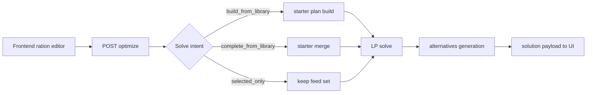

# 08 User Workflows

Updated: 2026-03-29  
Owner: repository  
Related: [[00-Index]], [[02-Domain-Rules]], [[05-API-Surface]], [[01-System-Overview]]  
Tags: #memory #workflow #user-journey

## Workflow A - Build a ration from library

### Goal

Create a usable starter ration when the user has no initial feed set.

### Steps

1. User creates/selects a ration with empty items.
2. User triggers optimization with intent `build_from_library` (or defaults to it for empty ration).
3. Backend builds starter items via `auto_populate` (feed groups, suitability, template shares).
4. Optimizer solves on starter ration.
5. Backend may attach alternatives for feasible results.
6. UI displays primary result, alternatives, and workflow notes.

### API touchpoints

| Step | Endpoint | Key data |
|---|---|---|
| starter-only preview | `POST /rations/:id/auto-populate` | `AutoPopulatePlan` |
| solve | `POST /rations/:id/optimize` | `OptimizeRequest` -> `DietSolution` |
| optional alternatives | `POST /rations/:id/alternatives` | `OptimizationResult` |

## Workflow B - Complete sparse ration from library

### Goal

Keep user-selected feeds and fill missing roles from the library.

### Steps

1. Ration has 1-2 feeds (sparse).
2. Optimization uses intent `complete_from_library` (explicit or default by state).
3. Starter plan is generated and merged only for missing feed IDs.
4. Solver runs in repair-oriented mode.
5. Response includes notes about added feeds and best-achievable state if applicable.

### Key behavior boundaries

- Existing selected feed IDs are preserved.
- Added feeds come from runtime feed groups and context suitability checks.
- If constraints remain infeasible, screening recommendations are returned.

## Workflow C - Optimize selected feeds only

### Goal

Balance the current ration without adding new library feeds.

### Steps

1. User provides a structured ration.
2. Intent `selected_only` is used.
3. Backend disables starter-plan merge and keeps current feed set.
4. Solver balances within current feeds; may report best-achievable mode.

### Key behavior boundaries

- No auto-add from library during main solve path.
- Recommendations may still suggest what to add if feed set is limiting.

## Workflow D - Compare alternatives

### Goal

Show nutritionally similar but feed-diverse options.

### Steps

1. Feasible primary solution is computed.
2. Alternatives engine generates candidate sets with diversity constraints.
3. Near-duplicates are filtered.
4. Cost/adequacy bands are applied to keep comparable options.
5. API returns primary + alternatives + comparison ranges.

### Output

- `cost_range`, `score_range`
- `common_feeds`, `differentiators`
- tagged variants (`lowest_cost`, `widest_mix`, etc.)

## End-to-end flow

