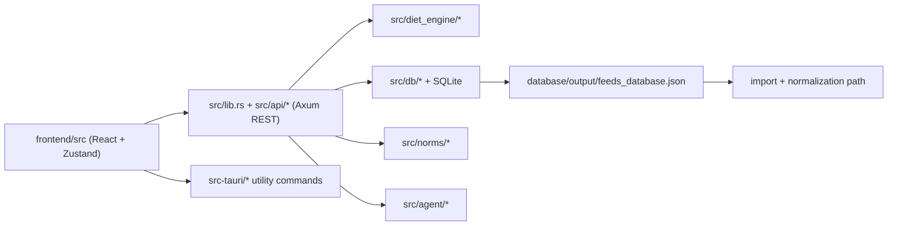

# 12 Dependency Map

Updated: 2026-03-30
Owner: repository
Related: [[00-Index]], [[01-System-Overview]], [[05-API-Surface]], [[03-Data-Model]]
Tags: #memory #dependencies #impact

## Runtime Dependency Graph

## Code Dependencies

| Module | Depends on | Notes |
|---|---|---|
| `frontend/src/lib/api.ts` | embedded Axum HTTP API | uses `/api/v1` in dev and `http://localhost:7432/api/v1` in Tauri |
| `src/api/rations.rs` | `diet_engine`, `db`, `norms` | main optimization orchestration layer |
| `src/diet_engine/optimizer.rs` | `norms`, feed groups, pricing data | LP formulation and constraint application |
| `src/diet_engine/auto_populate.rs` | feed groups, norms, library filters | starter-plan construction |
| `src/diet_engine/alternatives.rs` | optimized ration outputs | diverse solution generation |
| `src/agent/*` | `db`, LLM backend, prompt/tools | Ollama default, OpenAI-compatible optional |
| `src/bin/run_publication_benchmark.rs` | `diet_engine::benchmarking`, imported catalog | current optimizer benchmark path |
| `src/bin/run_agent_publication_benchmark.rs` | `AgentManager`, benchmark JSON | current agent benchmark path |

## Data Dependencies

| Artifact | Role | Current note |
|---|---|---|
| `database/output/feeds_database.json` | raw feed authority export | currently `2723` raw records |
| imported runtime catalog | operational feed cards in DB | deduplicated from raw export |
| `deliverables/paper_rework_2026-03-24/benchmark_results.json` | optimizer benchmark artifact | currently `1342` benchmark feed cards, `23` cases, `69` workflows |
| `deliverables/paper_rework_2026-03-24/agent_benchmark_results.json` | agent benchmark artifact | current 12-task aggregate |

## Knowledge Dependencies

- [[08-User-Workflows]] depends on [[05-API-Surface]]
- [[03-Data-Model]] supports [[04-Content-Lifecycle]]
- [[16-Implementation-Audit-and-Code-Graph]] tracks drift between implementation and prose

## Risk Chains

- vendor/data export drift -> import path -> runtime catalog counts -> benchmark prose
- agent backend/config drift -> technical docs -> manuscript methods -> reproducibility claims
- benchmark artifact drift -> paper metrics -> abstract/results inaccuracies
