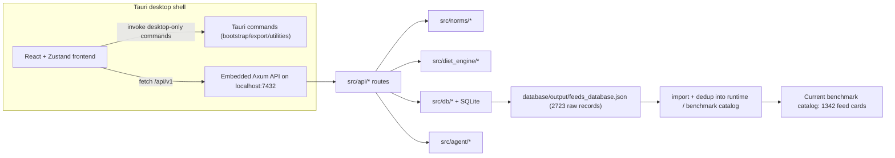

# 16 Implementation Audit and Code Graph

**Updated:** 2026-03-30  
**Owner:** repository  
**Related:** [[00-Index]], [[01-System-Overview]], [[05-API-Surface]], [[10-Decision-Records]], [[12-Dependency-Map]]  
**Tags:** #memory #audit #code-graph #consistency

## Purpose

Repository-backed architecture map and discrepancy register for implementation, memory, technical documentation, and manuscript claims.

## Verified Runtime Graph

## Verified Implementation Facts

- Main desktop workflow uses the embedded HTTP API, not pure Tauri IPC:
  - Tauri starts the embedded server in `src-tauri/src/main.rs`
  - frontend clients call `http://localhost:7432/api/v1` in Tauri production
- Core optimization endpoints:
  - `POST /rations/:id/optimize`
  - `POST /rations/:id/alternatives`
  - `POST /rations/:id/auto-populate`
- Builder workflows are controlled by solve `intent`:
  - `selected_only`
  - `complete_from_library`
  - `build_from_library`
- Solver `mode` is a separate concept from `intent`.
- Agent backend defaults to Ollama/Qwen, but `openai` is also implemented as a supported backend path.
- Current runtime default agent context in code is `16384` tokens.

## Benchmark Truth Snapshot

Current executable artifact reviewed:
- `deliverables/paper_rework_2026-03-24/benchmark_results.json`

Observed values:
- raw feed export count: `2723`
- benchmark catalog count: `1342`
- direct price anchors: `151`
- inferred/benchmark-priced feeds: `1191`
- cases: `23`
- workflow executions: `69`
- mean hard-pass rate: about `65.1%`
- mean norm coverage index: about `81.8`
- mean runtime across all workflows: about `6046.8 ms`
- median runtime across all workflows: about `1870.6 ms`

Current agent artifact reviewed:
- `deliverables/paper_rework_2026-03-24/agent_benchmark_results.json`

Observed values:
- model: `qwen3.5:4b`
- ration tasks: `6`
- lookup tasks: `6`
- overall applicability score: about `45 / 100`

## Discrepancy Register

| Area | Current implementation truth | Drift observed in docs/manuscript | Action |
|---|---|---|---|
| Desktop transport | Main UI path uses embedded HTTP API on `localhost:7432` | some technical-manual prose describes frontend-to-backend transfer through Tauri IPC | revise architecture wording |
| Agent backend scope | Ollama default, OpenAI-compatible optional | several notes/docs describe Ollama as the only backend | describe Ollama as default rather than exclusive |
| Agent context default | `16384` tokens in `AgentConfig` | memory says `8192`; manuscript says `8192` in one section and `4096` in another | normalize all prose to code or to explicitly benchmarked override |
| `/agent/chat/stream` semantics | current handler returns final JSON and is documented in code as non-streaming | route name suggests true streaming | document as compatibility route until streaming is implemented |
| Feed-library count | raw export `2723`; benchmark/runtime catalog `1342` | manuscript cites `1375` total and `1342` used | distinguish raw export vs deduplicated benchmark catalog |
| Price-layer count | current benchmark uses `151` direct anchors and `1191` inferred prices | manuscript cites `300` predefined market costs | replace stale count with current artifact-backed statement |
| Benchmark runtime headline | current artifact mean runtime is about `6046.8 ms` | manuscript abstract/results still cite `213.8 ms` | regenerate paper metrics from current artifact |
| Agent evaluation framing | current artifact is a 12-task benchmark with modest aggregate score | manuscript highlights a single `9/10` expert-rated scenario as if representative | recast single-case result as anecdotal and benchmark summary separately |
| Workflow terminology | `build_from_library`, `complete_from_library`, `selected_only` are solve intents | manuscript refers to them as optimization modes | relabel as workflows or intents |

## Publication Guardrails

- Do not quote benchmark numbers without naming the artifact path and date.
- Do not collapse raw feed-export counts and deduplicated runtime counts into one "library size" statement.
- Do not describe the agent as fully validated scientific infrastructure.
- Keep single-case agent examples separate from multi-case benchmark summaries.
