# 90 Graph Report

Updated: generated
Owner: scripts
Related: [[00-Index]], [[12-Dependency-Map]], [[13-Operating-Rules]]
Tags: #generated #graph #report

## Summary
- documents scanned: 26
- edges found: 137

## Orphans
- none

## Isolated
- none

## Link Counts
- [[00-Index]]: outgoing=18, incoming=20, raw_links=32
- [[01-System-Overview]]: outgoing=3, incoming=11, raw_links=3
- [[02-Domain-Rules]]: outgoing=4, incoming=6, raw_links=4
- [[03-Data-Model]]: outgoing=3, incoming=13, raw_links=3
- [[04-Content-Lifecycle]]: outgoing=4, incoming=4, raw_links=4
- [[05-API-Surface]]: outgoing=3, incoming=14, raw_links=3
- [[06-Customizations-vs-Vendor]]: outgoing=4, incoming=4, raw_links=4
- [[07-Security-Rules]]: outgoing=3, incoming=3, raw_links=3
- [[08-User-Workflows]]: outgoing=4, incoming=9, raw_links=4
- [[09-Change-Log]]: outgoing=9, incoming=10, raw_links=14
- [[10-Decision-Records]]: outgoing=4, incoming=6, raw_links=5
- [[11-Glossary]]: outgoing=3, incoming=4, raw_links=3
- [[12-Dependency-Map]]: outgoing=7, incoming=4, raw_links=9
- [[13-Developer-Operations]]: outgoing=3, incoming=2, raw_links=3
- [[13-Operating-Rules]]: outgoing=3, incoming=9, raw_links=5
- [[14-Session-Inbox]]: outgoing=5, incoming=6, raw_links=5
- [[15-Roadmap-and-Future-Work]]: outgoing=3, incoming=2, raw_links=3
- [[16-Implementation-Audit-and-Code-Graph]]: outgoing=5, incoming=2, raw_links=5
- [[90-Graph-Report]]: outgoing=25, incoming=1, raw_links=28
- [[change-planning]]: outgoing=5, incoming=1, raw_links=10
- [[db-impact-analysis]]: outgoing=3, incoming=1, raw_links=5
- [[memory-maintenance]]: outgoing=3, incoming=1, raw_links=5
- [[safe-edit-protocol]]: outgoing=3, incoming=1, raw_links=3
- [[session-discipline]]: outgoing=4, incoming=1, raw_links=8
- [[vendor-diff-analysis]]: outgoing=3, incoming=1, raw_links=4
- [[workflow-mapping]]: outgoing=3, incoming=1, raw_links=4

## Mermaid Graph

```mermaid
graph TD
  N_00_Index[00-Index] --> N_00_Index[00-Index]
  N_00_Index[00-Index] --> N_01_System_Overview[01-System-Overview]
  N_00_Index[00-Index] --> N_02_Domain_Rules[02-Domain-Rules]
  N_00_Index[00-Index] --> N_03_Data_Model[03-Data-Model]
  N_00_Index[00-Index] --> N_04_Content_Lifecycle[04-Content-Lifecycle]
  N_00_Index[00-Index] --> N_05_API_Surface[05-API-Surface]
  N_00_Index[00-Index] --> N_06_Customizations_vs_Vendor[06-Customizations-vs-Vendor]
  N_00_Index[00-Index] --> N_07_Security_Rules[07-Security-Rules]
  N_00_Index[00-Index] --> N_08_User_Workflows[08-User-Workflows]
  N_00_Index[00-Index] --> N_09_Change_Log[09-Change-Log]
  N_00_Index[00-Index] --> N_10_Decision_Records[10-Decision-Records]
  N_00_Index[00-Index] --> N_11_Glossary[11-Glossary]
  N_00_Index[00-Index] --> N_12_Dependency_Map[12-Dependency-Map]
  N_00_Index[00-Index] --> N_13_Developer_Operations[13-Developer-Operations]
  N_00_Index[00-Index] --> N_13_Operating_Rules[13-Operating-Rules]
  N_00_Index[00-Index] --> N_14_Session_Inbox[14-Session-Inbox]
  N_00_Index[00-Index] --> N_15_Roadmap_and_Future_Work[15-Roadmap-and-Future-Work]
  N_00_Index[00-Index] --> N_16_Implementation_Audit_and_Code_Graph[16-Implementation-Audit-and-Code-Graph]
  N_01_System_Overview[01-System-Overview] --> N_03_Data_Model[03-Data-Model]
  N_01_System_Overview[01-System-Overview] --> N_05_API_Surface[05-API-Surface]
  N_01_System_Overview[01-System-Overview] --> N_08_User_Workflows[08-User-Workflows]
  N_02_Domain_Rules[02-Domain-Rules] --> N_00_Index[00-Index]
  N_02_Domain_Rules[02-Domain-Rules] --> N_03_Data_Model[03-Data-Model]
  N_02_Domain_Rules[02-Domain-Rules] --> N_08_User_Workflows[08-User-Workflows]
  N_02_Domain_Rules[02-Domain-Rules] --> N_11_Glossary[11-Glossary]
  N_03_Data_Model[03-Data-Model] --> N_00_Index[00-Index]
  N_03_Data_Model[03-Data-Model] --> N_01_System_Overview[01-System-Overview]
  N_03_Data_Model[03-Data-Model] --> N_05_API_Surface[05-API-Surface]
  N_04_Content_Lifecycle[04-Content-Lifecycle] --> N_00_Index[00-Index]
  N_04_Content_Lifecycle[04-Content-Lifecycle] --> N_03_Data_Model[03-Data-Model]
  N_04_Content_Lifecycle[04-Content-Lifecycle] --> N_05_API_Surface[05-API-Surface]
  N_04_Content_Lifecycle[04-Content-Lifecycle] --> N_08_User_Workflows[08-User-Workflows]
  N_05_API_Surface[05-API-Surface] --> N_00_Index[00-Index]
  N_05_API_Surface[05-API-Surface] --> N_01_System_Overview[01-System-Overview]
  N_05_API_Surface[05-API-Surface] --> N_08_User_Workflows[08-User-Workflows]
  N_06_Customizations_vs_Vendor[06-Customizations-vs-Vendor] --> N_00_Index[00-Index]
  N_06_Customizations_vs_Vendor[06-Customizations-vs-Vendor] --> N_01_System_Overview[01-System-Overview]
  N_06_Customizations_vs_Vendor[06-Customizations-vs-Vendor] --> N_03_Data_Model[03-Data-Model]
  N_06_Customizations_vs_Vendor[06-Customizations-vs-Vendor] --> N_05_API_Surface[05-API-Surface]
  N_07_Security_Rules[07-Security-Rules] --> N_00_Index[00-Index]
  N_07_Security_Rules[07-Security-Rules] --> N_03_Data_Model[03-Data-Model]
  N_07_Security_Rules[07-Security-Rules] --> N_05_API_Surface[05-API-Surface]
  N_08_User_Workflows[08-User-Workflows] --> N_00_Index[00-Index]
  N_08_User_Workflows[08-User-Workflows] --> N_01_System_Overview[01-System-Overview]
  N_08_User_Workflows[08-User-Workflows] --> N_02_Domain_Rules[02-Domain-Rules]
  N_08_User_Workflows[08-User-Workflows] --> N_05_API_Surface[05-API-Surface]
  N_09_Change_Log[09-Change-Log] --> N_00_Index[00-Index]
  N_09_Change_Log[09-Change-Log] --> N_01_System_Overview[01-System-Overview]
  N_09_Change_Log[09-Change-Log] --> N_02_Domain_Rules[02-Domain-Rules]
  N_09_Change_Log[09-Change-Log] --> N_03_Data_Model[03-Data-Model]
  N_09_Change_Log[09-Change-Log] --> N_05_API_Surface[05-API-Surface]
  N_09_Change_Log[09-Change-Log] --> N_09_Change_Log[09-Change-Log]
  N_09_Change_Log[09-Change-Log] --> N_10_Decision_Records[10-Decision-Records]
  N_09_Change_Log[09-Change-Log] --> N_13_Operating_Rules[13-Operating-Rules]
  N_09_Change_Log[09-Change-Log] --> N_14_Session_Inbox[14-Session-Inbox]
  N_10_Decision_Records[10-Decision-Records] --> N_00_Index[00-Index]
  N_10_Decision_Records[10-Decision-Records] --> N_09_Change_Log[09-Change-Log]
  N_10_Decision_Records[10-Decision-Records] --> N_11_Glossary[11-Glossary]
  N_10_Decision_Records[10-Decision-Records] --> N_13_Operating_Rules[13-Operating-Rules]
  N_11_Glossary[11-Glossary] --> N_00_Index[00-Index]
  N_11_Glossary[11-Glossary] --> N_02_Domain_Rules[02-Domain-Rules]
  N_11_Glossary[11-Glossary] --> N_10_Decision_Records[10-Decision-Records]
  N_12_Dependency_Map[12-Dependency-Map] --> N_00_Index[00-Index]
  N_12_Dependency_Map[12-Dependency-Map] --> N_01_System_Overview[01-System-Overview]
  N_12_Dependency_Map[12-Dependency-Map] --> N_03_Data_Model[03-Data-Model]
  N_12_Dependency_Map[12-Dependency-Map] --> N_04_Content_Lifecycle[04-Content-Lifecycle]
  N_12_Dependency_Map[12-Dependency-Map] --> N_05_API_Surface[05-API-Surface]
  N_12_Dependency_Map[12-Dependency-Map] --> N_08_User_Workflows[08-User-Workflows]
  N_12_Dependency_Map[12-Dependency-Map] --> N_16_Implementation_Audit_and_Code_Graph[16-Implementation-Audit-and-Code-Graph]
  N_13_Developer_Operations[13-Developer-Operations] --> N_00_Index[00-Index]
  N_13_Developer_Operations[13-Developer-Operations] --> N_01_System_Overview[01-System-Overview]
  N_13_Developer_Operations[13-Developer-Operations] --> N_03_Data_Model[03-Data-Model]
  N_13_Operating_Rules[13-Operating-Rules] --> N_00_Index[00-Index]
  N_13_Operating_Rules[13-Operating-Rules] --> N_09_Change_Log[09-Change-Log]
  N_13_Operating_Rules[13-Operating-Rules] --> N_14_Session_Inbox[14-Session-Inbox]
  N_14_Session_Inbox[14-Session-Inbox] --> N_00_Index[00-Index]
  N_14_Session_Inbox[14-Session-Inbox] --> N_03_Data_Model[03-Data-Model]
  N_14_Session_Inbox[14-Session-Inbox] --> N_05_API_Surface[05-API-Surface]
  N_14_Session_Inbox[14-Session-Inbox] --> N_09_Change_Log[09-Change-Log]
  N_14_Session_Inbox[14-Session-Inbox] --> N_13_Operating_Rules[13-Operating-Rules]
  N_15_Roadmap_and_Future_Work[15-Roadmap-and-Future-Work] --> N_00_Index[00-Index]
  N_15_Roadmap_and_Future_Work[15-Roadmap-and-Future-Work] --> N_09_Change_Log[09-Change-Log]
  N_15_Roadmap_and_Future_Work[15-Roadmap-and-Future-Work] --> N_10_Decision_Records[10-Decision-Records]
  N_16_Implementation_Audit_and_Code_Graph[16-Implementation-Audit-and-Code-Graph] --> N_00_Index[00-Index]
  N_16_Implementation_Audit_and_Code_Graph[16-Implementation-Audit-and-Code-Graph] --> N_01_System_Overview[01-System-Overview]
  N_16_Implementation_Audit_and_Code_Graph[16-Implementation-Audit-and-Code-Graph] --> N_05_API_Surface[05-API-Surface]
  N_16_Implementation_Audit_and_Code_Graph[16-Implementation-Audit-and-Code-Graph] --> N_10_Decision_Records[10-Decision-Records]
  N_16_Implementation_Audit_and_Code_Graph[16-Implementation-Audit-and-Code-Graph] --> N_12_Dependency_Map[12-Dependency-Map]
  N_90_Graph_Report[90-Graph-Report] --> N_00_Index[00-Index]
  N_90_Graph_Report[90-Graph-Report] --> N_01_System_Overview[01-System-Overview]
  N_90_Graph_Report[90-Graph-Report] --> N_02_Domain_Rules[02-Domain-Rules]
  N_90_Graph_Report[90-Graph-Report] --> N_03_Data_Model[03-Data-Model]
  N_90_Graph_Report[90-Graph-Report] --> N_04_Content_Lifecycle[04-Content-Lifecycle]
  N_90_Graph_Report[90-Graph-Report] --> N_05_API_Surface[05-API-Surface]
  N_90_Graph_Report[90-Graph-Report] --> N_06_Customizations_vs_Vendor[06-Customizations-vs-Vendor]
  N_90_Graph_Report[90-Graph-Report] --> N_07_Security_Rules[07-Security-Rules]
  N_90_Graph_Report[90-Graph-Report] --> N_08_User_Workflows[08-User-Workflows]
  N_90_Graph_Report[90-Graph-Report] --> N_09_Change_Log[09-Change-Log]
  N_90_Graph_Report[90-Graph-Report] --> N_10_Decision_Records[10-Decision-Records]
  N_90_Graph_Report[90-Graph-Report] --> N_11_Glossary[11-Glossary]
  N_90_Graph_Report[90-Graph-Report] --> N_12_Dependency_Map[12-Dependency-Map]
  N_90_Graph_Report[90-Graph-Report] --> N_13_Developer_Operations[13-Developer-Operations]
  N_90_Graph_Report[90-Graph-Report] --> N_13_Operating_Rules[13-Operating-Rules]
  N_90_Graph_Report[90-Graph-Report] --> N_14_Session_Inbox[14-Session-Inbox]
  N_90_Graph_Report[90-Graph-Report] --> N_15_Roadmap_and_Future_Work[15-Roadmap-and-Future-Work]
  N_90_Graph_Report[90-Graph-Report] --> N_90_Graph_Report[90-Graph-Report]
  N_90_Graph_Report[90-Graph-Report] --> change_planning[change-planning]
  N_90_Graph_Report[90-Graph-Report] --> db_impact_analysis[db-impact-analysis]
  N_90_Graph_Report[90-Graph-Report] --> memory_maintenance[memory-maintenance]
  N_90_Graph_Report[90-Graph-Report] --> safe_edit_protocol[safe-edit-protocol]
  N_90_Graph_Report[90-Graph-Report] --> session_discipline[session-discipline]
  N_90_Graph_Report[90-Graph-Report] --> vendor_diff_analysis[vendor-diff-analysis]
  N_90_Graph_Report[90-Graph-Report] --> workflow_mapping[workflow-mapping]
  change_planning[change-planning] --> N_00_Index[00-Index]
  change_planning[change-planning] --> N_03_Data_Model[03-Data-Model]
  change_planning[change-planning] --> N_06_Customizations_vs_Vendor[06-Customizations-vs-Vendor]
  change_planning[change-planning] --> N_08_User_Workflows[08-User-Workflows]
  change_planning[change-planning] --> N_13_Operating_Rules[13-Operating-Rules]
  db_impact_analysis[db-impact-analysis] --> N_03_Data_Model[03-Data-Model]
  db_impact_analysis[db-impact-analysis] --> N_04_Content_Lifecycle[04-Content-Lifecycle]
  db_impact_analysis[db-impact-analysis] --> N_12_Dependency_Map[12-Dependency-Map]
  memory_maintenance[memory-maintenance] --> N_09_Change_Log[09-Change-Log]
  memory_maintenance[memory-maintenance] --> N_13_Operating_Rules[13-Operating-Rules]
  memory_maintenance[memory-maintenance] --> N_14_Session_Inbox[14-Session-Inbox]
  safe_edit_protocol[safe-edit-protocol] --> N_07_Security_Rules[07-Security-Rules]
  safe_edit_protocol[safe-edit-protocol] --> N_09_Change_Log[09-Change-Log]
  safe_edit_protocol[safe-edit-protocol] --> N_13_Operating_Rules[13-Operating-Rules]
  session_discipline[session-discipline] --> N_00_Index[00-Index]
  session_discipline[session-discipline] --> N_09_Change_Log[09-Change-Log]
  session_discipline[session-discipline] --> N_13_Operating_Rules[13-Operating-Rules]
  session_discipline[session-discipline] --> N_14_Session_Inbox[14-Session-Inbox]
  vendor_diff_analysis[vendor-diff-analysis] --> N_01_System_Overview[01-System-Overview]
  vendor_diff_analysis[vendor-diff-analysis] --> N_05_API_Surface[05-API-Surface]
  vendor_diff_analysis[vendor-diff-analysis] --> N_06_Customizations_vs_Vendor[06-Customizations-vs-Vendor]
  workflow_mapping[workflow-mapping] --> N_02_Domain_Rules[02-Domain-Rules]
  workflow_mapping[workflow-mapping] --> N_05_API_Surface[05-API-Surface]
  workflow_mapping[workflow-mapping] --> N_08_User_Workflows[08-User-Workflows]
```

